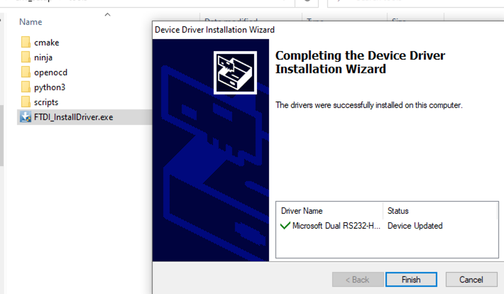
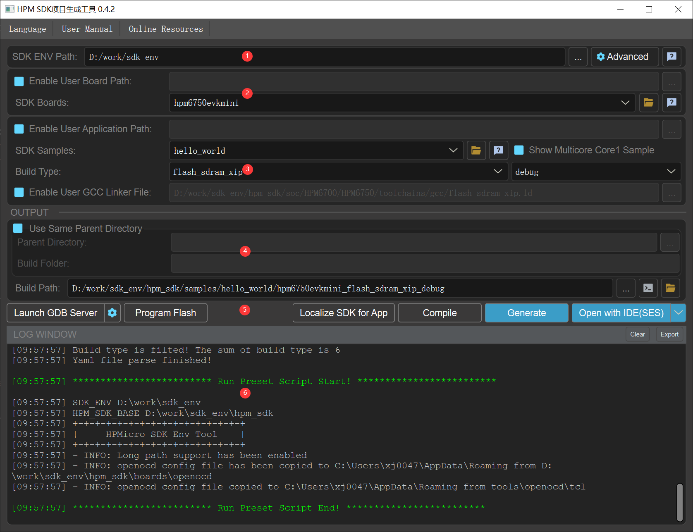

# HPM SDK Development Environment for Windows

## Quick Start Guide
1. Install FT2232 driver.

1. Open `start_cmd.cmd` to start a windows command prompt for HPM SDK development, it will configure all needed environment variables (only effective in this windows command prompt, not changing any in current system globally). So all the following operations need to be executed in this window command prompt opened by `start_cmd.cmd`. This windows command prompt will be refered as **sdk prompt**
1. The script will generate all examples' segger project of all vailable boards under folder  samples_ses_project by clicking `generate_all_ses_projects.cmd`.

## start_gui quick start
`start_gui.exe` is a visual tool which is used to generate project by `hpm_sdk`. User can not only generate sample in `hpm_sdk`, but also generate private application by custom sample directory. The whole GUI of `start_gui.exe` is shown as below:

The tool is split to different sections according by different background color:

1. SDK ENV configuration: You can set SDK ENV path manually. After clicking `Advanced` button, you can set the details of `hpm_sdk` path and `CMake、Ninja` path and so on.

2. Board configuration: the tool will list all the boards in `hpm_sdk/boards` by default. And it also supports loading custom board configuration. You need to select `Enable User Board Path` at first and then `User Board` search fuction will be enabled. Then, you need to select a board folder which is used to be searched. And the tool will search `current folder` and `the first level subfolders`. When `CMakeLists.txt and the yaml file whose name is the folders'` are found in the folder, the folder will be recongized as the board configuration and added to list. What's more, if the current folder is recongnized as the board configuration, the tool will not search its subfolders.

**Note: If custom board is used, the cfg file whose name is as same as the board will be searched as openocd board config file automatically in CMake generating process. If the file is not found, openocd will not add any board config file.**

3. Sample configuration: After selecting a board, the tool will filter samples by the yaml configuration and display the sample list by default. The tool also supports loading custom sample configuration. You need to select `Enable User Application Path` at first and then `User Applications` will be enabled. Then you need to select a sample which you want to search. The tool wiil search `current folder and all of the subfolders`. When `CMakeLists.txt` is found, the tool will search whether `hpm-sdk` is invoked and add the sample to the list. After selecting a sample, the tool will find all the build types supported by the sample and add them to the list.

4. Output configuration: You can custom the generation path in output section. The tool will use `${sample}/${board}_${build_type}` as the generation path by default. What's more, the tool supports parent directory which you can generate different projects in. You need to select `Use Same Parent Directory` at first and then select a parent directory. After that, all the projects will be generated to the parent directory. `Build Folder` is the project folder whose name will be generated as `${sample}_${board}_${build_type}` automatically. You can also change the folder name manually.

5. Generate options: After configuration, you can use `Generate Project` to generate project. When the project is generated success, `Open Project with IDE` will be highlighted and can be clicked to open the IDE. What's more, the tool supports console compiling. You can open the console by clicking `Open Build Console`, which is loaded `SDK_ENV` environment variables by default.

6. Log window: The log window shows all the log informations and supports clearing and exporting.

## Folder structure:
- hpm_sdk: sdk root directory in which sdk zip package should be unzip to, please make sure the folder of "cmake" can be found via path hpm_sdk\cmake
- toolchains: toolchain should be put in this folder. For example, copy toolchain files to toolchains folder, then riscv32-elf-\*-gcc.exe must be found at toolchains\TOOLCHAIN_NAME\bin
  - Note:
    - TOOLCHAIN_NAME needs to be configured correctly in start_cmd.cmd
- tools:
  - ninja
  - cmake
  - python3
  - openocd
  - scripts
  - project_generator
  - FTDI_InstallDriver.exe: FT2232 windows driver installer
- doc: documentation

## FAQ
### Can't find FTDI debug probe
  - Make sure install driver (FTDI_InstallDriver.exe) correctly. Please be aware it might need to be installed again if the debug usb cable is pluged to another USB port on PC.
### Segger Embedded Studio fails to debug
  Please try to following options
  - Reopen Segger Embedded Studio, and try to debug again
  - Close Segger Embedded Sutdio, then kill the process of "openocd" in Window task manager, reopen Segger Embedded Studio and try to debug again.
  - Set boot mode to "ISP" or "Serial Download Mode" on evaluation board, then press reset button the board, try to debug again.
### Issue caused by Windows 10 path limit
  To enable long path support, please import registry file located at tools/scripts/win10_enable_long_path.reg. For more details about this limitation, please refer to https://docs.microsoft.com/en-us/windows/win32/fileio/maximum-file-path-limitation?tabs=cmd
  
