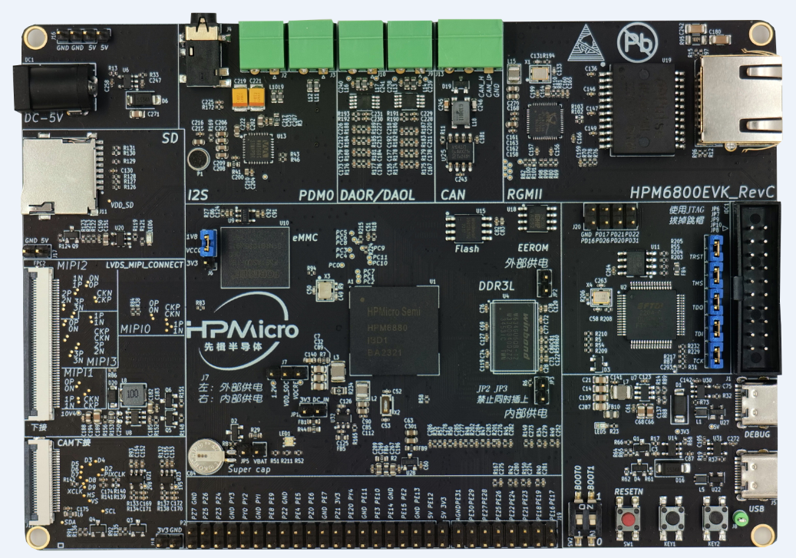

# HPM6800EVK

## Overview

The HPM6800 is a single-core flashless MCU running 600Mhz. It has a 1MB continuous on-chip ram. Also, it provides various memory interfaces, including SDRAM, Quad SPI NOR Flash, SD/eMMC. It integrates rich audio and video interfaces, including LCD, pixel DMA, camera， and I2S audio interfaces.

 

## Hardware

- HPM6800 MCU (600MHz, 1MB SRAM)
- Onboard Memory
  - 512MB SDRAM (DDR3L 16bits)
  - 16MB Quad SPI NOR Flash
  - 16GB eMMC
- Display & Camera
  - LCD connector
  - MIPI-DSI
  - MIPI-CSI
  - Camera (DVP)
- Ethernet
  - 1000 Mbits PHY
- USB
  - USB type C (USB 2.0 OTG) connector x1
- Audio
  - Line in
  - Mic
  - DAO
- Others
  - TF Slot
  - RGB LED
  - CAN

## DIP Switch SW2

- Bit 1 and 2 controls boot mode

| bit[2:1] | Description                  |
| -------- | ---------------------------- |
| OFF, OFF | Boot from Quad SPI NOR flash |
| OFF, ON  | Boot from eMMC               |
| ON, OFF  | ISP                          |

(lab_hpm6800_evk_board)=

## Button

(lab_hpm6800_evk_board_buttons)=

| Name         | FUNCTIONS                                      |
| ------------ | ---------------------------------------------- |
| USER BUTTON(KEY1)  | User Button                                   |
| WBUTN (KEY2)  | WAKE UP Button                                 |
| RESETN (SW1)  | Reset Button                                   |

## Plug-in

- The ADC/DAC reference voltage is selected as follows:

  | Connection | Description         |
  | ---------- | ------------------- |
  | J18       |  Reference voltage |

- The eMMC voltage is sleected as follows:
  | Connection | Description         |
  | ---------- | ------------------- |
  | J6       |  eMMC voltage selection (3.8V / 1.8V) |

Note: User should short VCCQ and 1.8V pin for eMMC testing

## Pin Description

- UART0 Pin:

The UART0 use for debugger console:

| Function | Pin  | Position |
| -------- | ---- | ----------|
| UART0.TX | PA00 | DEBUGUART0 |
| UART0.RX | PA01 | DEBUGUART0 |

- UART3 Pin:

 The UART3 is used for some functional testing using UART, such as MICROROS_UART, USB_CDC_ACM_UART, MODBUS_RTU etc.

| Function | Pin  | Position | Remark   |
| -------- | ---- | ----------| ------   |
| UART3.TX | PE15 | P2[8]  |
| UART3.RX | PE14 | P2[10] |
| UART3.break | PE04 | P2[24] | generate uart break signal |

- PUART Pin:

 The PUART is used for low power mode testing, such as wakeup, etc.

| Function | Pin  | Position |
| -------- | ---- |  --------- |
| PUART.TX | PY00 | P2[32]  |
| PUART.RX | PY01 | P2[29]  |

- SPI Pin：

| Function  | Pin  | Position |
| --------- | ---- | -------- |
| SPI3.CSN  | PE04 | P2[24]   |
| SPI3.SCLK | PE05 | P2[23]   |
| SPI3.MISO | PE06 | P2[21]   |
| SPI3.MOSI | PE07 | P2[19]   |

- I2C Pin：：

| Function | Pin  | Position |
| -------- | ---- | -------- |
| I2C1.SCL | PE13 | P2[5]    |
| I2C1.SDA | PE12 | P2[3]    |

- ADC16 Pin

| Function          | Pin   | Position |
| ----------------- | ----- | -------- |
| ADC0.INA8         | PE16  | J19[15]  |

- GPTMR Pin

| Function      | Pin   | Position| Remark   |
| ------------- | ----- | ------- | -------- |
| GPTMR2.CAPT_0 | PE22  | J19[9]  |
| GPTMR2.COMP_0 | PE23  | J19[12] | MCLK of i2s emulation  |
| GPTMR2.COMP_1 | PE24  | J19[10] | LRCK of i2s emulation |
| GPTMR2.COMP_2 | PE26  | J19[6]  | BLCK of i2s emulation |

- headphone interface

| Function        | Position | Standard |
| --------------- | -------- | -------- |
| 3.5mm headphone | J4       | OMTP |

- audio input interface

| Function   | Position |
| ---------- | -------- |
| microphone | P1       |

- DAO interface

| Function       | Position |
| -------------- | -------- |
| DAO-SPK(left)  | J9       |
| DAO-SPK(right) | J10      |

- Ethernet PPS Pin

| Function    | Pin  | Position |
| ----------- | ---- | -------- |
| ENET0.EVTO0 | PD31 | J20[7]  |
| ENET0.EVTO1 | PE10 | P2[11]  |
| ENET0.EVTI0 | PE17 | J19[16]  |
| ENET0.EVTI1 | PE19 | J19[14]  |

- CAN Pin

| Function   | Pin    | Position  | Output        |
| -----------| ------ | -----     | ------------- |
| MCAN3.TXD  | PD15   | U25[1]    |  CAN.H J13[3] |
| MCAN3.RXD  | PD14   | U25[4]    |  CAN.L J13[2] |
| MCAN3.STBY | PD13   | U25[8]    |               |

- Tamper Pin

| Function | Pin    | Position |  Mode  |
|----------|--------|--------|----------|
| TAMP.04  | PZ04   | P2[35] | Active Mode |
| TAMP.05  | PZ05   | P2[38] | Active Mode |
| TAMP.06  | PZ06   | P2[37] | Passive Mode |

- CS Pin of i2s emulation

| Function | Position   |  Remark |
| ----     | -----      | ------ |
| PE27      | J19[5]    | the pin that controls the SPI slave CS |
