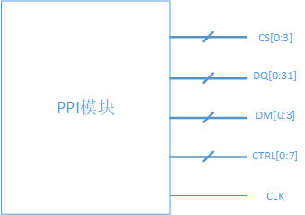

## PPI

### PPI 资源特性介绍

- 支持4个CS端口，每个CS端口可以单独配置：地址区间（基地址需1MB对齐）、端口位宽 （支持 8/16/32 位） 和命令序列 （命令的起始/结束索引）
- 有32位数据/地址总线，支持：32位数据 + 32位地址（复用模式）、16位数据 + 32位地址（复用模式）、 8位数据 + 32位数据（复用模式）、16位数据 + 16位地址（非复用模式）、8位数据 + 24位地址（非复用模式）
- 有4个有效字节选择端口（DM信号，用于SRAM的UB/LB等信号）
- 有8个控制线（可配置为SRAM的WE/OE/ADV等信号）
- 有1个时钟线输出（支持时钟始终输出和跟随指令序列输出）


### PPI 配置介绍

- CS配置
  CS配置结构体如下：
  ```c
  typedef struct {
      ppi_port_size_t port_size;
      uint16_t addr_start_high_12bits;    /* address space: 0xF8000000 ~ 0xFFFFFFFF */
      uint16_t addr_end_high_12bits;      /* address space: 0xF8000000 ~ 0xFFFFFFFF */
      uint16_t addr_mask;
      bool sync_clk_en;
      uint8_t sync_clk_sel;
      uint8_t interval_cycle;
      uint8_t rcmd_start0;
      uint8_t rcmd_end0;
      uint8_t rcmd_start1;
      uint8_t rcmd_end1;
      uint8_t wcmd_start0;
      uint8_t wcmd_end0;
      uint8_t wcmd_start1;
      uint8_t wcmd_end1;
  #if defined(HPM_IP_FEATURE_PPI_DM_POLARITY_EACH_CS) && HPM_IP_FEATURE_PPI_DM_POLARITY_EACH_CS
      ppi_dm_valid_polarity_t dm_polarity;
  #endif
  } ppi_cs_pin_config_t;    /**< ppi_cs_pin_config_t */
  ```
  - PPI 的地址空间为0xF8000000 ~ 0xFFFFFFFF，为 Noncacheable 属性。
  - `port_size`为端口位宽，`addr_start_high_12bits`和`addr_end_high_12bits`分别为起始地址的高12位和结束地址的高12位，`addr_mask`为高16位地址掩码。
  - `sync_clk_en`为是否同步时钟使能，`sync_clk_sel`为CS输出有效电平的时刻选择（范围为 0 ~ clkpin_cfg.cycle），`interval_cycle`为命令间隔时间（单位为系统时钟周期）。
  - `rcmd_start0`和`rcmd_end0`为首条读命令的起始/结束索引，`wcmd_start0`和`wcmd_end0`为首条写命令的起始/结束索引；`rcmd_start1`和`rcmd_end1`为第二条及后续读命令的起始/结束索引，`wcmd_start1`和`wcmd_end1`为第二条及后续写命令的起始/结束索引。例如，有些支持 burst 传输的设备，首次访问和后续访问时序会不同，所以每个设备可以配置不同的首次访问和后续访问的命令序列。起始/结束索引对应为64个命令字的索引，范围为0 ~ 63。

- CMD命令字配置
  - 一共有64个命令字，4个CS共用。
  - 每次数据传输，可以切成若干片段，每个片段由一个命令字描述。例如，在如下的《PPI组件介绍》章节中，读/写指令均分为4个片段。
  - 针对每个片段，可配置该片段的持续时间（`cmd_cycle`）、CS引脚的输出电平（`cs_pin_value`）、DQ引脚功能（`ad_func_sel`，数据/地址，1个字节为一组）、DQ引脚方向（`ad_pin_dir`，输入/输出，1个字节为一组）、输出字节的来源（`byte_sel`）、8根控制线的电平（`ctrl_pin_value`）、时钟输出使能（`clk_output`，时钟引脚在cmd控制输出模式有效），CMD命令字结构体如下：
  ```c
  typedef struct {
    bool cs_pin_value;
    bool clk_output;
    uint8_t cmd_cycle;
    ppi_ad_func_t ad_func_sel[4];
    ppi_ad_pin_dir_t ad_pin_dir[4];
    ppi_byte_sel_t byte_sel[4];
    bool ctrl_pin_value[8];
  } ppi_cmd_config_t;    /**< ppi_cmd_config_t */
  ```

- 控制引脚配置
  - 一共有8个控制信号引脚。
  - 可以独立配置每个控制引脚的方向和极性，配置的API如下：
  ```c
  static inline void ppi_config_ctrl_pin_polarity(PPI_Type *ppi, uint8_t index, ppi_ctrl_polarity_t pol);
  static inline void ppi_set_ctrl_pin_dir(PPI_Type *ppi, uint8_t index, ppi_ctrl_pin_dir_t dir);
  ```

- 时钟引脚配置
  - 一共有1 个时钟信号输出。
  - 时钟有2种工作模式：（1）始终输出；（2）由CMD控制输出，即ppi_cmd_config.clk_output控制时钟输出。
  - 时钟引脚配置的结构体如下
  ```c
  typedef struct {
    uint8_t cycle_num;
    uint8_t high_num;
    uint8_t low_num;
    ppi_clk_output_mode_t mode;
    bool revert;
  } ppi_clk_pin_config_t;    /**< ppi_clk_pin_config_t */
  ```
  其中，`cycle_num`、`high_num`、`low_num`三个参数控制输出时钟的周期，`mode`配置工作模式，`revert`控制时钟输出是否取反。

### PPI 组件介绍

目前PPI组件实现了异步SRAM的读写时序，支持地址/数据复用模式和非复用模式，各模式的引脚对应如下：

| AD复用模式 | 数据线 | 地址线 | 地址锁存器 |
| -------- | ------ | ------ | -------- |
| 32位数据 + 32位地址 | D0 - D31 : DQ0 - DQ31 | A0 - A31 : DQ0 - DQ31 | DQ0 - DQ31 需要地址锁存器 |
| 16位数据 + 32位地址 | D0 - D15 : DQ0 - DQ15 | A0 - A31 : DQ0 - DQ31 | DQ0 - DQ15 需要地址锁存器，DQ16 - DQ31 无需地址锁存器 |
| 8位数据 + 32位地址  | D0 - D7 : DQ0 - DQ7  | A0 - A31 : DQ0 - DQ31 | DQ0 - DQ7 需要地址锁存器，DQ8 - DQ31 无需地址锁存 |

| AD非复用模式 | 数据线 | 地址线 |
| -------- | ------ | ------ |
| 16位数据 + 16位地址 | D0 - D15 : DQ0 - DQ15 | A0 - A15 : DQ16 - DQ31 |
| 8位数据 + 24位地址  | D0 - D7 : DQ0 - DQ7  | A0 - A23 : DQ8 - DQ31 |


异步SRAM配置的结构体如下：

```c
typedef struct {
    uint32_t base_address;              /**< external SRAM base address, should be 1MB aligned */
    uint32_t size_in_byte;              /**< external SRAM size in byte */
    ppi_port_size_t port_size;          /**< port size */
    bool ad_mux_mode;                   /**< addr and data mux mode */
    bool cs_valid_polarity;             /**< cs valid polarity */
    bool dm_valid_polarity;             /**< dm valid polarity */
    bool addr_valid_polarity;           /**< addr valid polarity */
    uint8_t adv_ctrl_pin;               /**< adv ctrl pin number, 0 - 7 */
    uint8_t rel_ctrl_pin;               /**< rel ctrl pin number, 0 - 7 */
    uint8_t wel_ctrl_pin;               /**< wel ctrl pin number, 0 - 7 */
    uint8_t as_in_ns;                   /**< address setup time */
    uint8_t ah_in_ns;                   /**< address hold time */
    uint8_t rel_in_ns;                  /**< RE low time */
    uint8_t reh_in_ns;                  /**< RE high time */
    uint8_t wel_in_ns;                  /**< WE low time */
    uint8_t weh_in_ns;                  /**< WE high time */
} ppi_async_sram_config_t;

```

对应的读写时序图为：


其中，CS为片选信号，ADV、RE、WE为控制信号（在8个控制线中进行选择）。cs、adv、dm的有效极性可以进行配置。

PPI组件配置异步SRAM的API如下，每个CS配置会占用8个CMD命令字，故cmd_start_index需要设置为8的倍数，例如0、8、16、24等。
```c
/**
 * @brief config async sram
 *
 * @param[in] ppi PPI base address
 * @param[in] cs_index cs index, value: 0 - 3
 * @param[in] cmd_index cmd start index, should be a multiple of 8, such as 0, 8, 16, 24 ...
 * @param[in] config async sram config structure pointer, @ref ppi_async_sram_config_t
 */
void ppi_config_async_sram(PPI_Type *ppi, uint8_t cs_index, uint8_t cmd_start_index, ppi_async_sram_config_t *config);
```
