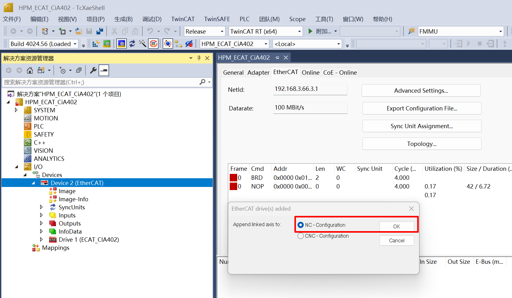
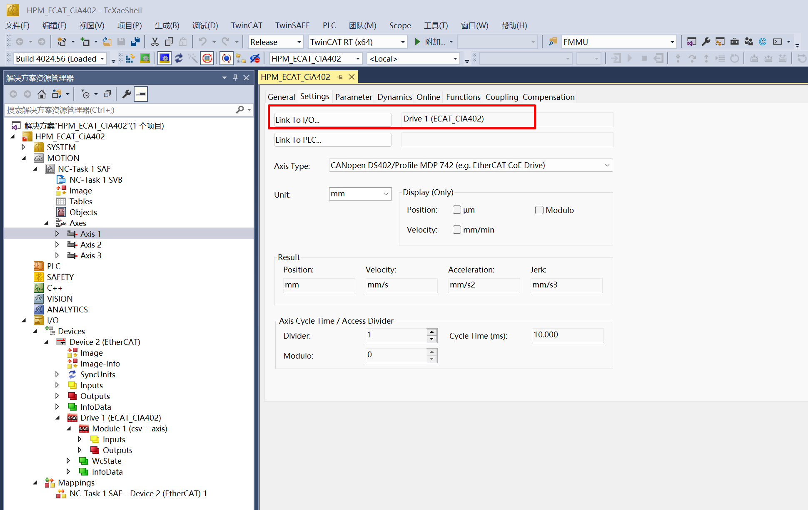
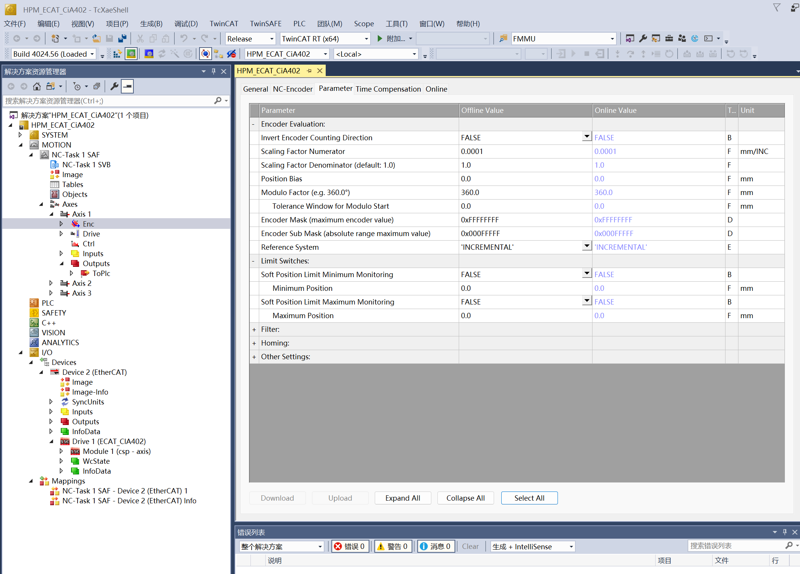
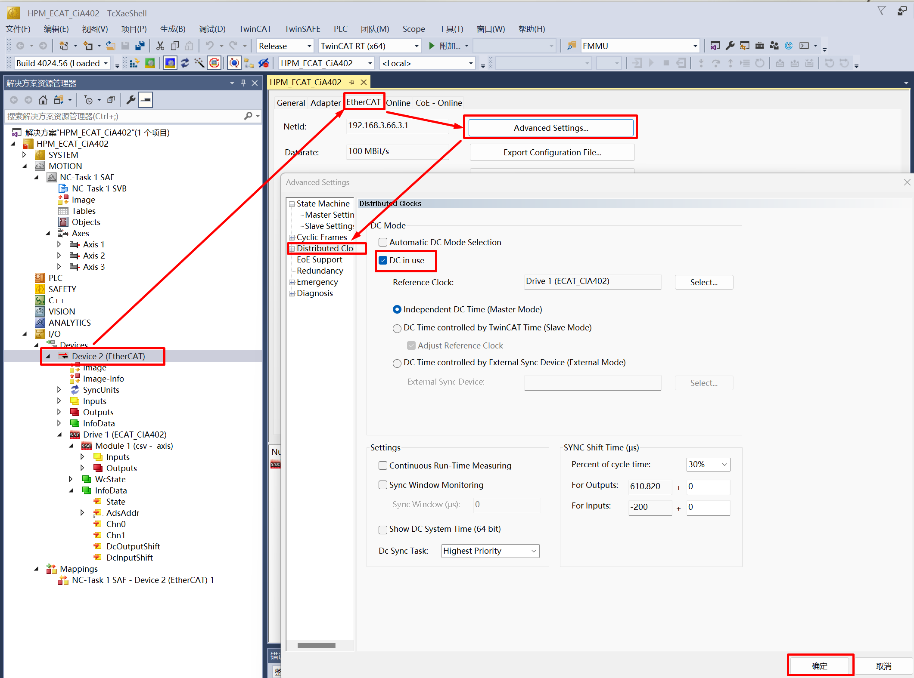
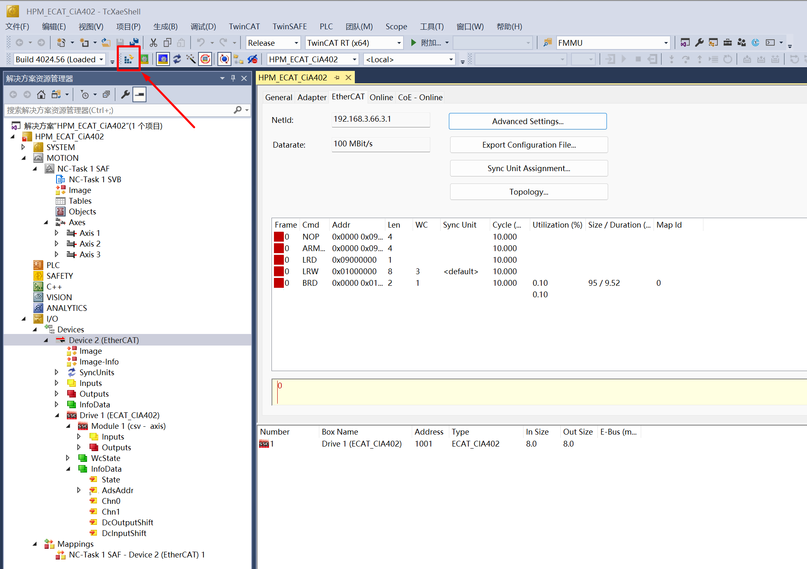
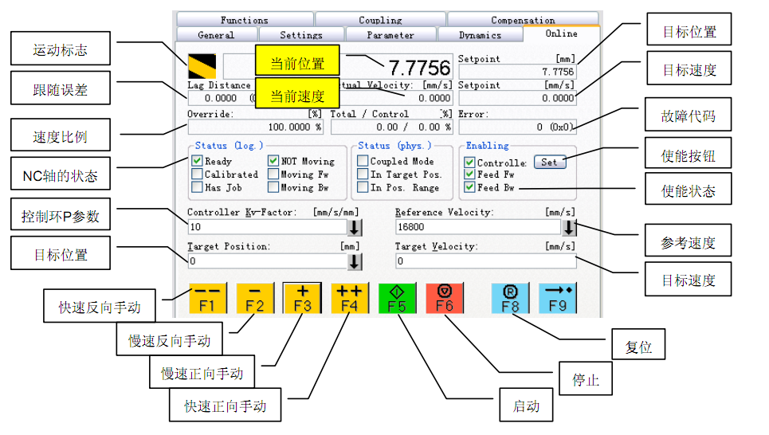
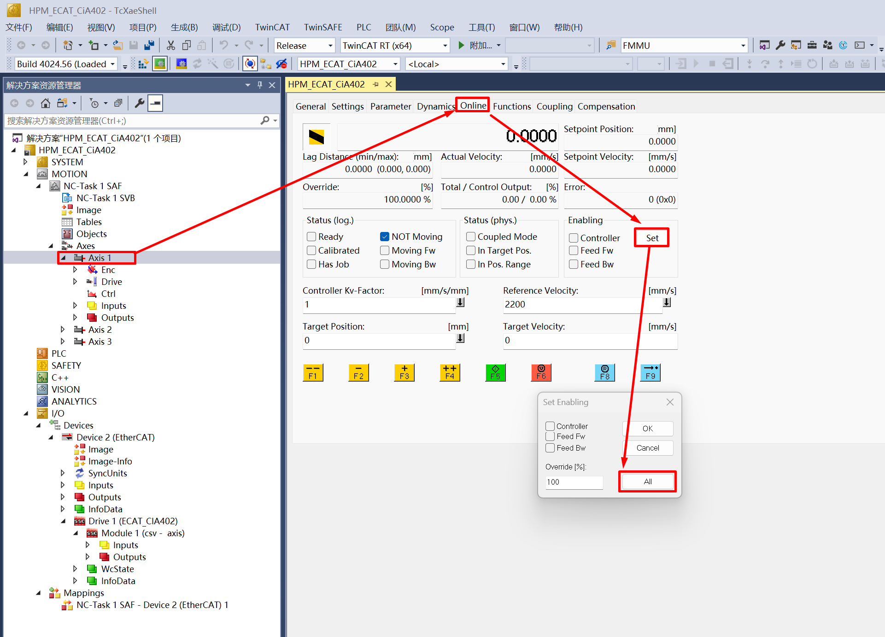
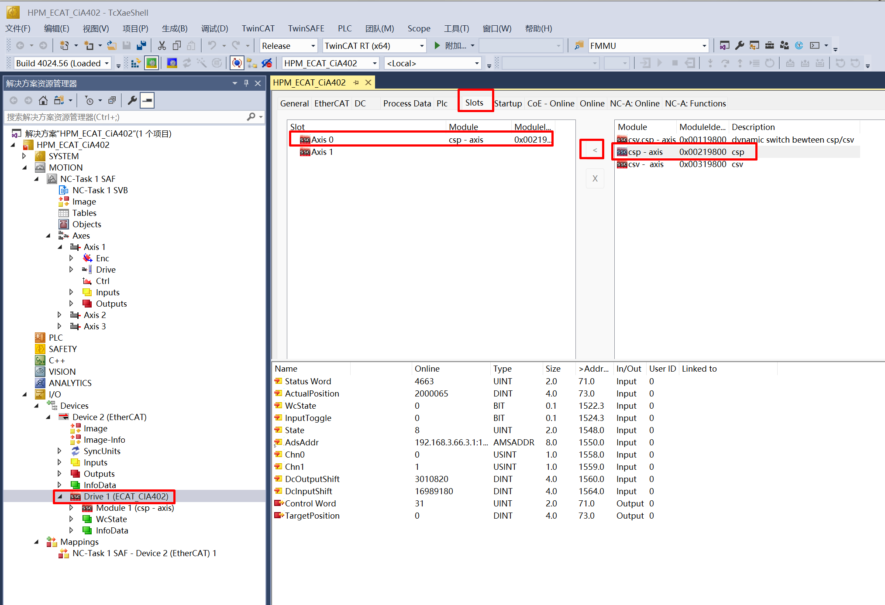
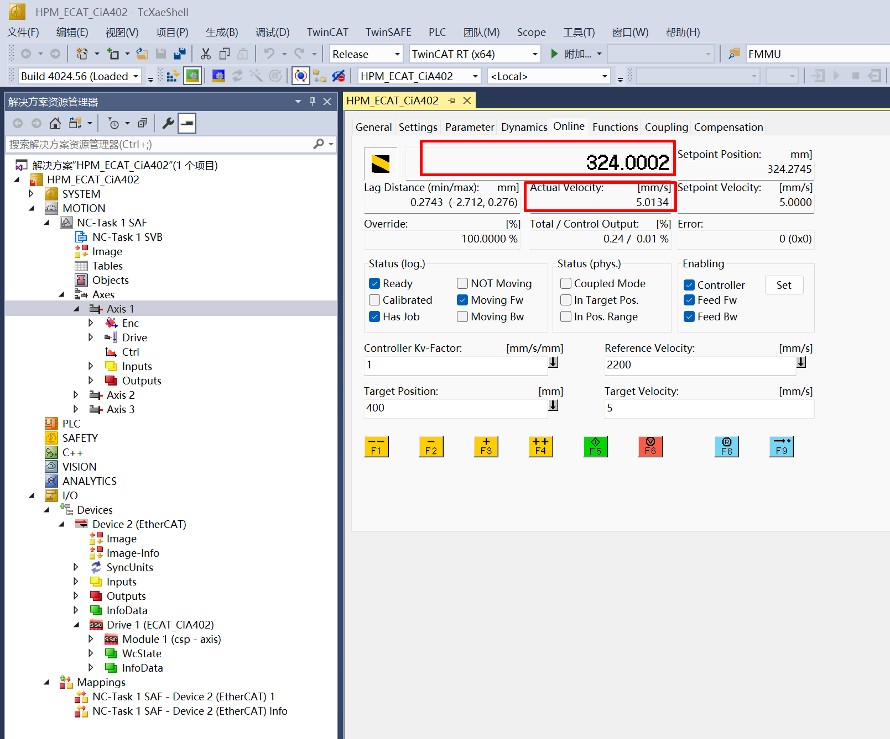

# ECAT_CiA402

## 1. Overview

The ECAT_CIA402 example demonstrates the use of ESC peripherals and the implementation of CANOPEN CiA402 protocol control motor function based on ETG slave protocol stack code (SSC).

## 2. Prepare

  Please refer to the README of ECAT_IO sample

  - This program uses the **BLM57050-1000** brushless motor of "Leisai Intelligence", please refer to the [Leisai Intelligence](https://leisai.com/) website for the specific parameters of the motor.

  - Board settings refer to the development board documentation [Motor Pin](lab_board_motor_ctrl_pin) related content

  - After completing the above process, power on the driver board and observe that the current is normal. Then, power on the core board and confirm that the current is normal again. After that, you can burn the program and observe the running phenomenon.

## 3. Project Setting

### 3.1 Flash emulate EEPROM
  Please refer to the README of ECAT_IO sample

  **Note**: When using FLASH to simulate EEPROM, please allocate appropriate flash space for FLASH-EEPROM content to avoid conflicts with other flash contents

### 3.2 Using virtual motor

  By default, the actual motor is used for motion control. If a virtual motor is required, set "set (CONFIG_CIA402_USING_ACTUAL_MOTOR 0)" in the file `CMakeLists. txt`.

## 4. Generate EtherCAT slave stack code

Due to licensing issues, HPMSDK does not provide EtherCAT slave protocol stack code (SSC). Users have download the SSC Tool from Beckoff's official website and generate the slave stack code according to the steps.

### 4.1. Download SSC Tool

  Please refer to the README of ECAT_IO sample

### 4.2 SSC Tool import configuration files
  Please refer to the README of ECAT_IO sample, import configuration file path: <hpm_sdk>/samples/ethercat/ecat_cia402/SSC/Config/HPM_ECAT_CIA402_Config.xml

### 4.3 Create slave stack files
  1. create new project, select the configuration file
  
  2. Specify the output path and generate slave stack code

### 4.4 SSC code change
  Add motor control related codes to the code generated by SSC by patching.
  Execute in the command line window under the SSC directory：patch -d Src < ssc_cia402.patch
  

  **Note**：If the patch command is not installed on your PC, you will need to install ver. 2.5.9 or a laterversion of GNU patch. If it is already installed, skip this step. Download the patch command (currently ver. 2.5.9) from the following Web page and store "patch.exe" in a folder on a path that makes the file executable from the command prompt. http://gnuwin32.sourceforge.net/packages/patch.htm

## 5. TwinCAT Project setting

### 5.1. Add ESI file
  Copy the generated ESI xml by SSC tool in previous steps to TwinCAT(**C:\TwinCAT\3.1\Config\Io\EtherCAT**).

### 5.2 Create Project
  Please refer to the README of ECAT_IO sample

### 5.3 Software Configuration
  Please refer to the README of ECAT_IO sample

### 5.4 Scan device
  Please refer to the README of ECAT_IO sample

### 5.5 Update EEPROM context
  Please refer to the README of ECAT_IO sample, select ESI file
  

### 5.6 NC axis control
  1. scan device，add NC-Configuration, the default mode is csv：
      
      
  2. check device sync unit setting, device should sync with NC task
      
  3. check the link relationship between NC Axis and Devie
      
  4. Check encoder parameter for NC Axis
      
  5. Set the NC Task cycle, and the DC cycle will be the same as this value.

      A larger cycle time can be set here to avoid the "0x1a Synchronization error" caused by communication jitter due to poor real-time performance of the PC when using it as the TwinCAT master station
      
  6. Set DC mode
      
      
  7.  Set the NC axis parameters to disable the limit setting to avoid errors during testing operations.
      
  8. active configuration，enter Run mode
      
  9. NC axis online function description
      
  10. ontrol NC axis motion on csv mode
    a. In "Enabling" option, click “Set->All”， enable the NC controller
      
    b. Set the target position and speed, note that the target speed value should not exceed 7mm/s(Virtual motors have no speed limit). After setting, click "F5" to start
      
    c. View actual postion and velocity
      
      
  11. change NC axis control mode to csp
    
  12. link NC Axis and Device
    
  13. refer to step 8, reactivate the configuration
  14. ontrol NC axis motion on csp mode
    a. Refer to the steps 10.a to enable the controller
    a. Set the target position and speed, note that the target speed value should not exceed 7mm/s. After setting, click "F5" to start
      
    b. View actual postion and velocity
      
      


## 6. Running the example

After the project is running correctly, the serial terminal will output the following information. The motor motion can be controlled through the TwinCAT NC Axis control page:
```console
EtherCAT CiA402 sample
EEPROM loading with checksum error.
EtherCAT communication is possible even if the EEPROM is blank(checksum error),
but PDI not operational, please update eeprom  context.
```
or
```console
EtherCAT CiA402 sample
EEPROM loading successful, no checksum error.
```


