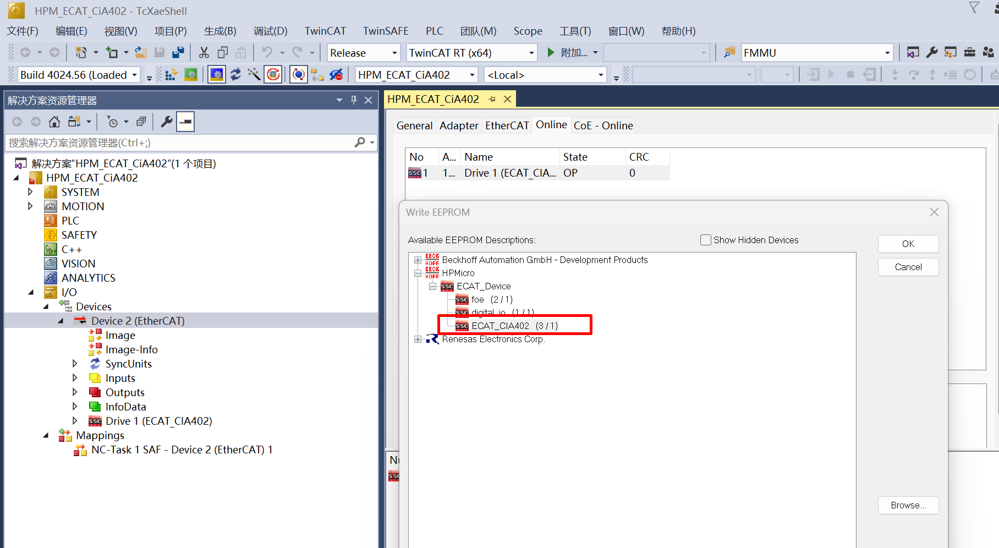
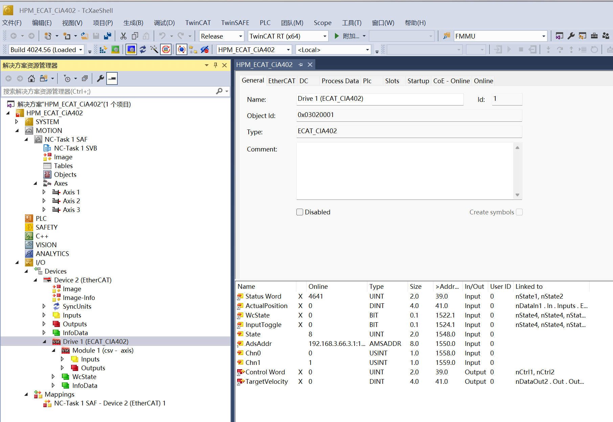
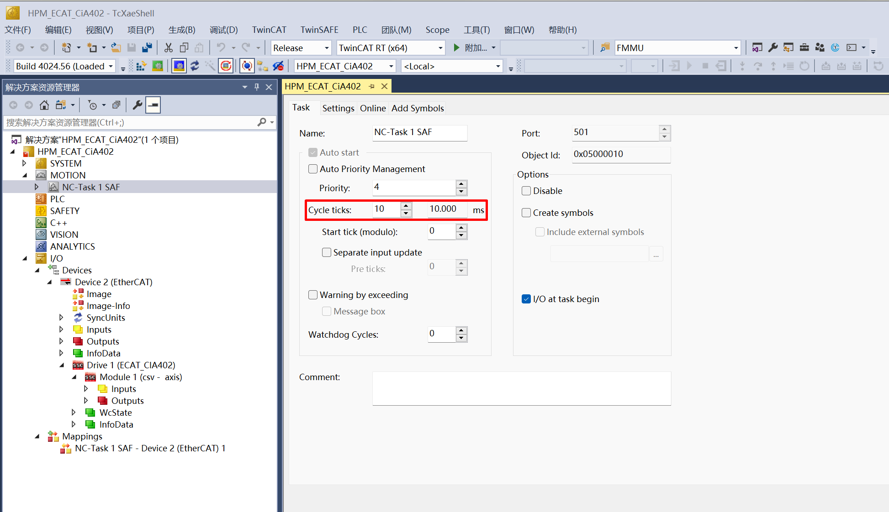
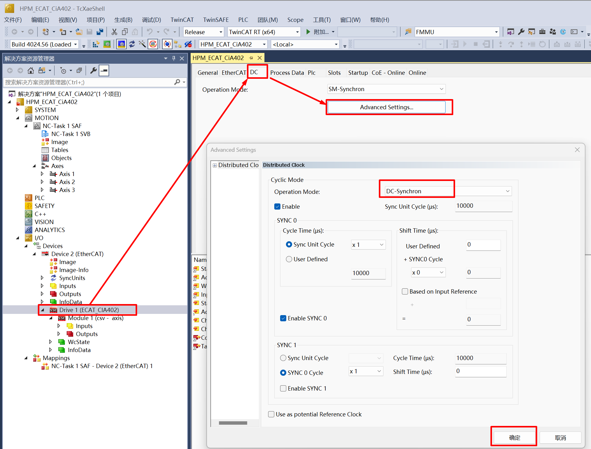
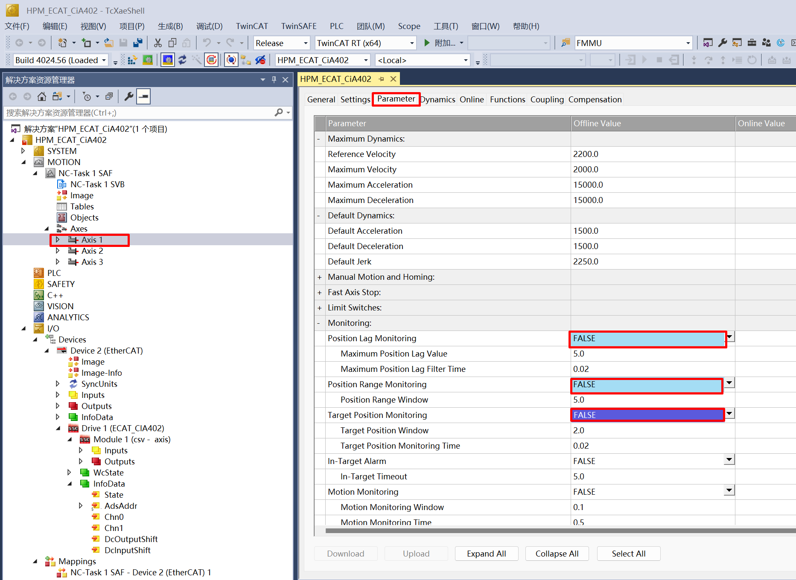
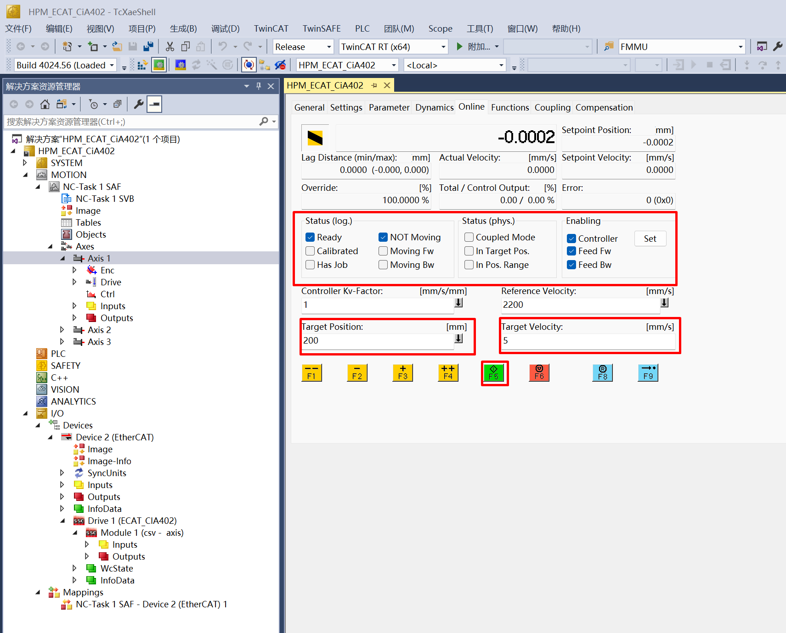
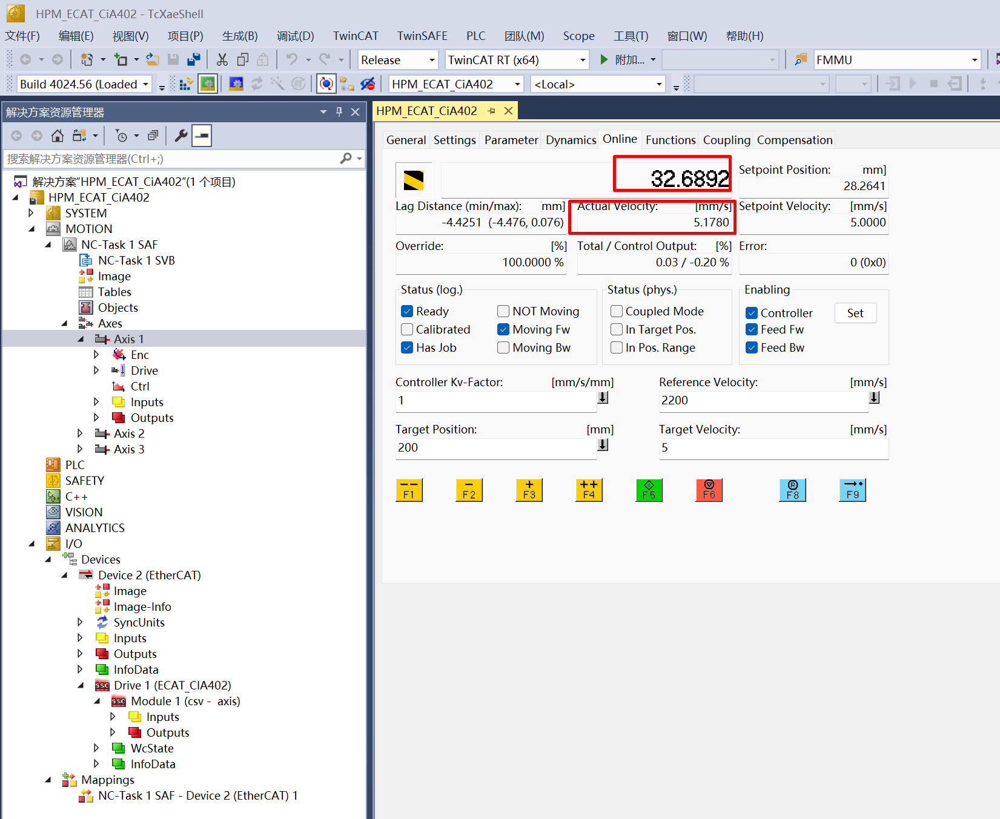
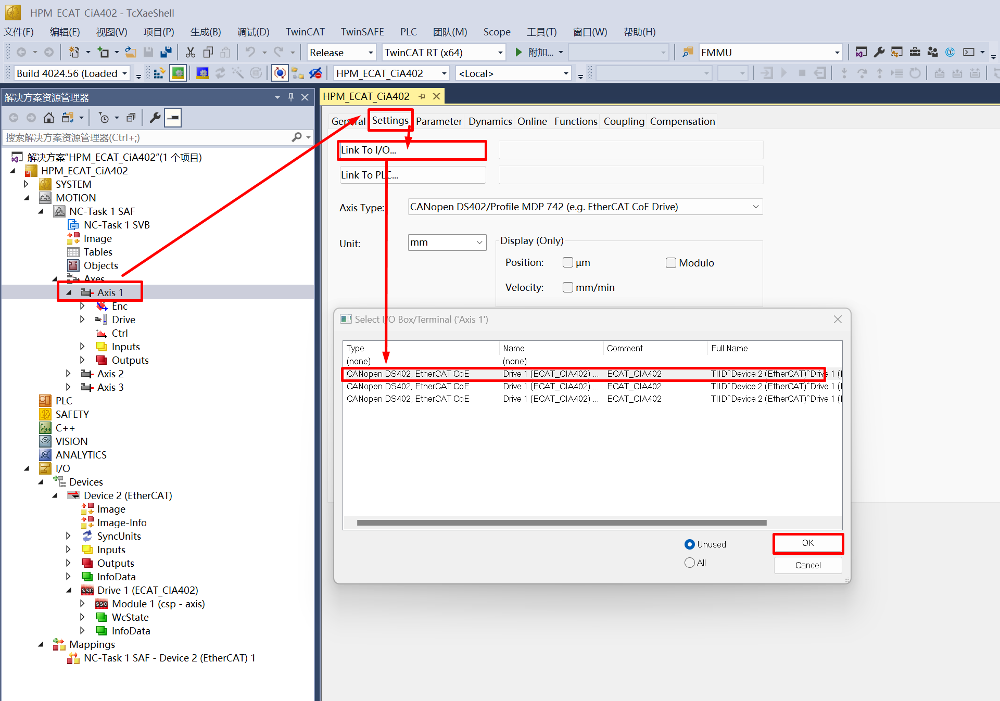
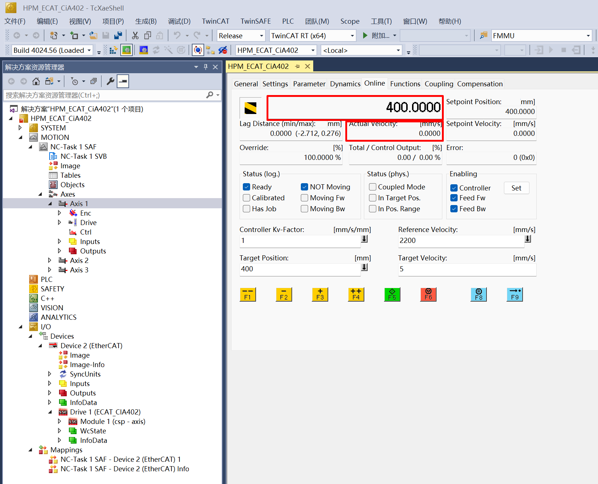

# ECAT_CiA402

## 1. 概述

ECAT_CIA402示例演示使用ESC外设, 基于ETG从站协议栈代码(SSC)实现CANOPEN CiA402协议控制电机的功能。

该例程程序支持对ESC的EEPROM数据进行初始化，能够简化更新ESC的EEPROM的步骤。

如果程序代码中包含由SSC Tool生成的EEPROM数据(eeprom.h), 会检查ESC的EEPROM中存储的数据并根据条件进行更新。

如果EEPROM中的EtherCAT Slave Controller Configuration Area(前8个Word)的数据checksum校验失败，则会使用eeprom.h中的数据初始化EEPROM。

如果EEPROM中的EtherCAT Slave Controller Configuration Area(前8个Word)的数据checksum校验成功，则会进一步校验EEPROM数据中的Product Code和Revision Code。

当Product Code不同或eeprom.h中的Revision Number大于当前已经存储的EEPROM数据的Revision Number时，则会使用eeprom.h中的数据初始化EEPROM。

该方法能够解决初次使用时EEPROM为空情况下checksum校验失败的问题，能够对EEPROM进行初始化。在程序升级阶段，新的程序代码包含的eeprom.h中的Revision Number大于当前已经存储的EEPROM数据的Revision Number时，会使用新程序中的eeprom.h初始化EEPROM，而无需通过主站工具如TwinCAT等去更新EEPROM。

## 2. 准备
  请参照ECAT_IO的README

  - 本例程电机使用的是雷赛智能的 **BLM57050-1000** 无刷电机，电机具体参数请参考[雷赛智能官网](https://leisai.com/)。

  - 板子设置参考开发板文档[Motor Pin](lab_board_motor_ctrl_pin)相关内容

  - 完成上述过程后，给驱动板上电观察电流无异常后，给核心板上电，再次确认电流无异常后，就可以烧录程序，观察运行现象。

## 3. 工程设置

### 3.1 使用Flash模拟EEPROM
  请参照ECAT_IO的README

  **注意**: 使用FLASH模拟EEPROM功能时,需要为FLASH_EEPROM内容分配合适的flash空间, 避免与其他的flash内容产生冲突。

### 3.2 使用虚拟电机

  默认使用实际电机进行运动控制，如果需要使用虚拟电机, 在文件`CMakeLists.txt`中, 设置"set(CONFIG_CIA402_USING_ACTUAL_MOTOR 0)"。

## 4. 生成从站协议栈代码

由于许可问题, HPM_SDK不提供EtherCAT从站协议栈代码(SSC), 用户须从倍福官网下载SSC Tool并生成从站协议栈代码。

### 4.1. 下载SSC Tool
  请参照ECAT_IO的README

### 4.2 SSC Tool中导入配置文件
  请参考ECAT_IO的README描述, 配置文件路径为: <hpm_sdk>/samples/ethercat/ecat_foe/SSC/Config/HPM_ECAT_CIA402_Config.xml

### 4.3 SSC Tool生成协议栈代码
  1. 创建新工程, 选择指定的配置文件
    
  2. 指定输出路径,生成协议栈代码

### 4.4 SSC协议栈代码修改

  通过打patch的方式添加电机控制相关代码到SSC生成的代码。
  在SSC目录下的命令行窗口执行：patch -d Src < ssc_cia402.patch
  

  **注意**：如果你的电脑上没有安装patch命令，你需要安装2.5.9版或更高版本的GNU patch。如果已安装，请跳过此步骤。从以下网页下载patch命令（当前版本为2.5.9），并将“patch.exe”存储在一个文件夹中，该文件夹的路径使文件可以从命令提示符执行。http://gnuwin32.sourceforge.net/packages/patch.htm

## 5. TwinCAT工程设置

### 5.1. 添加ESI文件
  将SSC工具生成的ESI文件复制到TwinCAT的安装目录下(如: **C:\TwinCAT\3.1\Config\Io\EtherCAT**)

### 5.2 创建工程
  请参照ECAT_IO的README

### 5.3 软件配置
  请参照ECAT_IO的README

### 5.4 扫描设备
  请参照ECAT_IO的README

### 5.5 更新EEPROM
  请参照ECAT_IO的README, 选择正确的ESI文件更新EEPROM内容
  

### 5.6 NC轴控制操作
  1. 扫描设备,建立NC轴, 从站默认工作在csv模式：
      
      
  2. 检查同步单元设置, DC周期会与NC-Task同步
      
  3. 检查NC Axis与Device的链接关系
      
  4. 检查NC Axis的Enc参数
      
  5. 设置NC Task周期, DC周期应与该值相同。

      此处可以设置大一些的周期时间， 避免使用PC做TwinCAT主站时， 由于PC实时性较差造成通信抖动引起"0x1a Synchronnization error".
      
  6. 设置DC模式
      
      
  7. 设置NC轴参数, 关闭主站的软件限位设置,避免测试操作中报错。
      
  8. 激活配置,进入运行模式
      
  9. NC轴控制页面选项说明
      
  10. 在线控制NC轴运动
    a. 在"Enabling"选项中点击"Set->All",启动控制器
      
    b. 设置目标位置和速度, 注意目标速度值不应超过7mm/s(虚拟电机没有速度限制), 设置后点击"F5"启动
      
    c. 查看目标实际位置和速度
      
      
  11. 更改NC轴控制模式为csp
    
  12. 将NC Axis与Device重新链接
    
  13. 参考步骤8， 重新激活配置
  14. 按照上诉步骤使能控制器， 设置新的目标位置和速度, 观察实际位置和速度的变化
    a. 参考步骤10.a, 使能控制器
    a. 设置新的目标位置和速度，注意目标速度值不应超过7mm/s, 设置后点击"F5"启动
      
    b. 查看目标实际位置和速度
      
      

## 6. 运行现象

当工程正确运行后, 串口终端会输出如下信息, 通过TwinCAT NC Axis控制页面可以控制电机运动：

当需要初始化EEPROM数据时，log如下：
```console
EtherCAT CiA402 motor sample
Init EEPROM content.
Init EEPROM content successful.
EEPROM loading successful, no checksum error.
```
当不需初始化EEPROM数据时，log如下：
```console
EtherCAT CiA402 motor sample
No need to init EEPROM content.
EEPROM loading successful, no checksum error.
```


