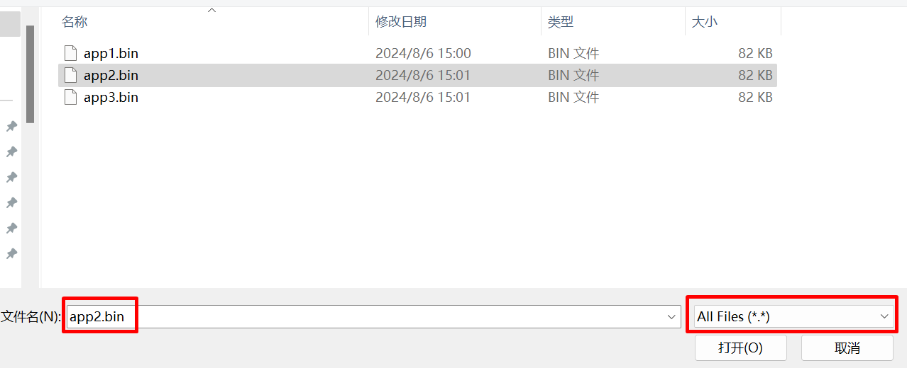
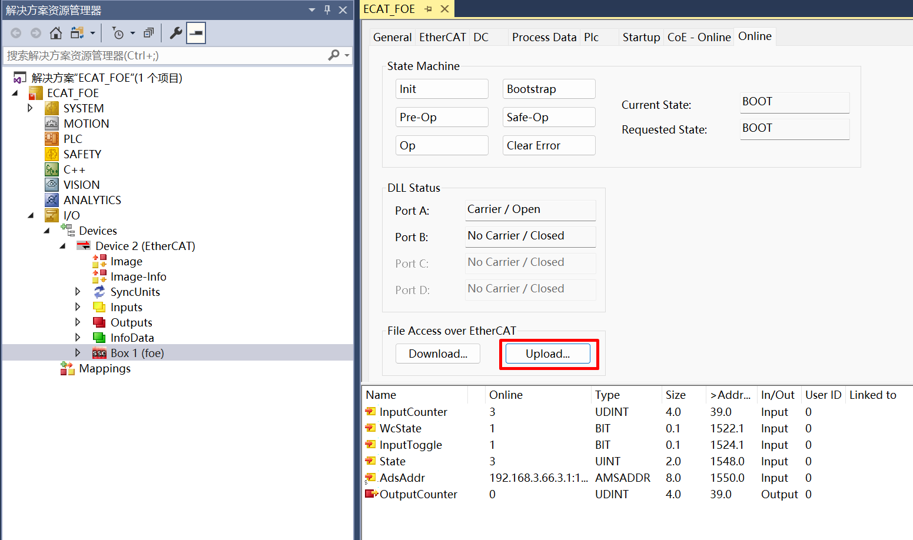

# ECAT_FOE

## 1. Overview

The ECAT_FOE example demonstrates the functionality of ECAT FOE to write and read slave files.

Using ECAT FOE to update firmware, please refer to the OTA sample in hpm_apps repo.

This routine program supports initializing the EEPROM data of the ESC, simplifying the process of updating the ESC's EEPROM.

If the program code contains EEPROM data (eeprom.h) generated by the SSC Tool, it will check the data stored in the ESC's EEPROM and update it based on conditions.

If the checksum of the EtherCAT Slave Controller Configuration Area (the first 8 words) of the EEPROM failed, the EEPROM will be initialized with the data from eeprom.h.

If the checksum of the EtherCAT Slave Controller Configuration Area (the first 8 words) of the EEPROM succeeds, will verify the Product Code and Revision Code in the EEPROM data.

When the Product Code differs or the Revision Number in eeprom.h is greater than the Revision Number of the currently stored EEPROM data, the EEPROM will be initialized with the data from eeprom.h.

This method can solve the problem of checksum failure caused by EEPROM being empty during initial use, it will initialize EEPROM. During program upgrades, if the Revision Number in the eeprom.h included in the new program code is greater than the Revision Number of the currently stored EEPROM data, the EEPROM will be initialized with the eeprom.h, eliminating the need to update the EEPROM through master station tools such as TwinCAT.

hpm_apps repo：
  github: https://github.com/hpmicro/hpm_apps
  gitee: https://gitee.com/hpmicro/hpm_apps

## 2. Prepare

  Please refer to the README of ECAT_IO sample
  Software tool version: SSC Tool (SSC Version: 5.13.1; Config File Vers: 1.5.3.0)

## 3. Project Setting

  Please refer to the README of ECAT_IO sample

  **Note**: When using FLASH to simulate EEPROM, please allocate appropriate flash space for FLASH-EEPROM content to avoid conflicts with other flash contents

## 4. Generate EtherCAT slave stack code

Due to licensing issues, HPMSDK does not provide EtherCAT slave protocol stack code (SSC). Users have download the SSC Tool from Beckoff's official website and generate the slave stack code according to the steps.

### 4.1. Download SSC Tool

  Please refer to the README of ECAT_IO sample

### 4.2 SSC Tool import configuration files
  configuration file path: <hpm_sdk>/samples/ethercat/ecat_foe/SSC/Config/HPM_ECAT_FOE_Config.xml

### 4.3 SSC Tool create slave stack
  1. Create new project based on specifed configuration
  2. Import application file: <hpm_sdk>/samples/ethercat/ecat_foe/SSC/foe.xlsx
  3. Specify the output path and generate slave stack code

## 5. TwinCAT Project setting
  Please refer to the README of ECAT_IO sample

### 5.1. Add ESI file
  Copy the generated ESI xml by SSC tool in previous steps to TwinCAT(**C:\TwinCAT\3.1\Config\Io\EtherCAT**).

### 5.2 Create Project
  Please refer to the README of ECAT_IO sample

### 5.3 Software Configuration
  Please refer to the README of ECAT_IO sample

### 5.4 Scan device
  Please refer to the README of ECAT_IO sample

### 5.5 Update EEPROM context
  select **foe**
  


### 5.6 FOE action
  1. Set MailBox timeout time (when the file is large, the timeout time needs to be adjusted)
  
  2. Enter Bootstrap mode
  
  3. Download file
    click 'Download'
    
    select file to download
    
    edit file name and password， file name：**app**; pass word：**87654321**.
    
    waiting for completion of writing
  4. Enter Bootstrap mode，uploade file
    click 'Uplaod'
    
    select file name and path
    
    edit file name and password， file name：**app**; pass word：**87654321**.
    
    waiting for completion of reading
  4. quit Bootstrap mode

## 6. Running the example

After the project is running correctly：

When EEPROM data needs to be initialized, the log is as follows:
```console
EtherCAT FOE sample
Write or Read file from flash by FOE
Init EEPROM content.
Init EEPROM content successful.
EEPROM loading successful, no checksum error.
```
When EEPROM data does not need to be initialized, execute file write and read operations in Twincat, comparing the written and read files to ensure consistency. The log is as follows:
```console
EtherCAT FOE sample
Write or Read file from flash by FOE
No need to init EEPROM content.
EEPROM loading successful, no checksum error.
Write file start
Write file finish
Read file start
Read file finish
```
