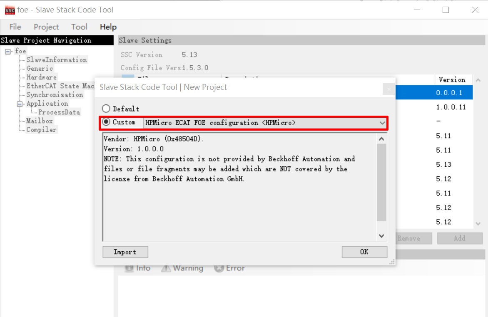

# ECAT_FOE

## 1. 概述

ECAT_FOE示例演示使用ECAT外设和从站协议栈代码(SSC)实现ECAT FOE读写从站文件的功能。

关于使用ECAT FOE更新firmware的功能演示， 请参考hpm_apps中OTA相关例程。

该例程程序支持对ESC的EEPROM数据进行初始化，能够简化更新ESC的EEPROM的步骤。

如果程序代码中包含由SSC Tool生成的EEPROM数据(eeprom.h), 会检查ESC的EEPROM中存储的数据并根据条件进行更新。

如果EEPROM中的EtherCAT Slave Controller Configuration Area(前8个Word)的数据checksum校验失败，则会使用eeprom.h中的数据初始化EEPROM。

如果EEPROM中的EtherCAT Slave Controller Configuration Area(前8个Word)的数据checksum校验成功，则会进一步校验EEPROM数据中的Product Code和Revision Code。

当Product Code不同或eeprom.h中的Revision Number大于当前已经存储的EEPROM数据的Revision Number时，则会使用eeprom.h中的数据初始化EEPROM。

该方法能够解决初次使用时EEPROM为空情况下checksum校验失败的问题，能够对EEPROM进行初始化。在程序升级阶段，新的程序代码包含的eeprom.h中的Revision Number大于当前已经存储的EEPROM数据的Revision Number时，会使用新程序中的eeprom.h初始化EEPROM，而无需通过主站工具如TwinCAT等去更新EEPROM。

hpm_apps仓库：
  github: https://github.com/hpmicro/hpm_apps
  gitee: https://gitee.com/hpmicro/hpm_apps

## 2. 准备

  请参照ECAT_IO的README
  软件版本：SSC Tool(SSC Version: 5.13.1; Config File Vers: 1.5.3.0)

## 3. 工程设置

  请参照ECAT_IO的README

  **注意**: 使用FLASH模拟EEPROM功能时，需要为FLASH_EEPROM内容分配合适的flash空间， 避免与其他的flash内容产生冲突。

## 4. 生成从站协议栈代码

由于许可问题, HPM_SDK不提供EtherCAT从站协议栈代码(SSC), 用户须从倍福官网下载SSC Tool并生成从站协议栈代码

### 4.1. 下载SSC Tool

  请参照ECAT_IO的README

### 4.2 SSC Tool中导入配置文件
  配置文件路径为: <hpm_sdk>/samples/ethercat/ecat_foe/SSC/Config/HPM_ECAT_FOE_Config.xml

### 4.3 SSC Tool生成协议栈代码
  1. 创建新工程，选择指定的配置文件
    
  2. 导入应用xlsx：<hpm_sdk>/samples/ethercat/ecat_foe/SSC/foe.xlsx
  3. 指定输出目录，生成从站协议栈代码

## 5. TwinCAT工程设置
  请参照ECAT_IO的README

### 5.1. 添加ESI文件
  将SSC工具生成的ESI文件复制到TwinCAT的安装目录下(如: **C:\TwinCAT\3.1\Config\Io\EtherCAT**)

### 5.2 创建工程
  请参照ECAT_IO的README

### 5.3 软件配置
  请参照ECAT_IO的README

### 5.4 扫描设备
  请参照ECAT_IO的README

### 5.5 更新EEPROM
  请选择**foe**设备描述文件
  


### 5.6 FOE操作
  1. 设置MailBox timeout时间(当文件比较大时， 需要调整timeout时间)
  
  2. 选择从站， 进入Bootstrap模式
  
  3. 进入Bootstrap模式后， 下载文件到从站
    点击Download
    
    选择要下载的文件，源文件名和文件格式并不限定，但需要在编辑FOE名页面将文件名称改为指定名称
    
    编辑文件名称和密码， 文件名称是：**app**; 密码是：**87654321**.
    
    等待写进度条完成
  4. 进入Bootstrap模式后，从从站读取文件
    点击Uplaod
    
    选择文件保存文件和名称, 需要保存的文件名和文件格式并不限定，但需要在编辑FOE文件名页面将文件名称修改为指定名称
    
    编辑文件名称和密码，文件名称是：**app**; 密码是：**87654321**.
    
    等待读进度条完成
  4. 退出Bootstrap模式

## 6. 运行现象

当工程正确运行后, 串口终端会输出如下信息：

当需要初始化EEPROM数据时，log如下：
```console
EtherCAT FOE sample
Write or Read file from flash by FOE
Init EEPROM content.
Init EEPROM content successful.
EEPROM loading successful, no checksum error.
```
当不需初始化EEPROM数据时，在Twincat中可以进行文件写读操作，对比写下去与读回来的文件保持一致，log如下：
```console
EtherCAT FOE sample
Write or Read file from flash by FOE
No need to init EEPROM content.
EEPROM loading successful, no checksum error.
Write file start
Write file finish
Read file start
Read file finish
```
