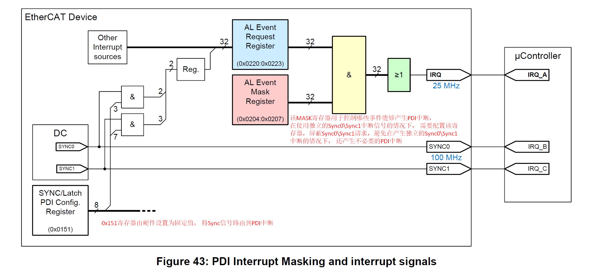
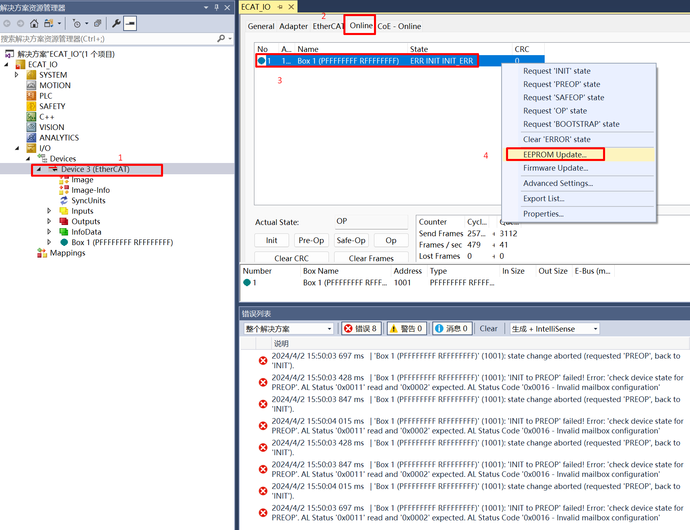
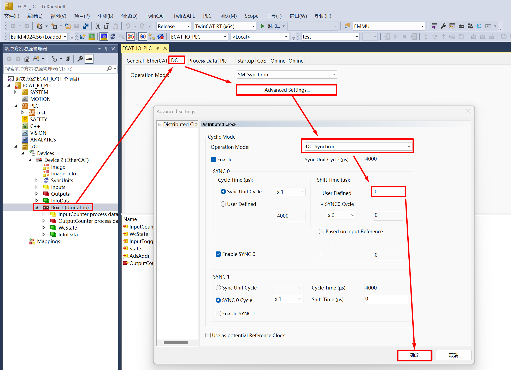
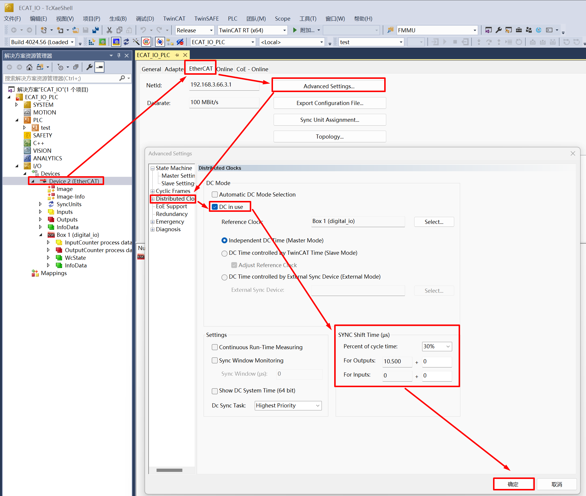

# ECAT_IO

## 1. 概述

ECAT_IO示例用于演示使用ESC外设和从站协议栈代码(SSC)实现ECAT数字IO从站的功能。

该例程程序支持对ESC的EEPROM数据进行初始化，能够简化更新ESC的EEPROM的步骤。

如果程序代码中包含由SSC Tool生成的EEPROM数据(eeprom.h), 会检查ESC的EEPROM中存储的数据并根据条件进行更新。

如果EEPROM中的EtherCAT Slave Controller Configuration Area(前8个Word)的数据checksum校验失败，则会使用eeprom.h中的数据初始化EEPROM。

如果EEPROM中的EtherCAT Slave Controller Configuration Area(前8个Word)的数据checksum校验成功，则会进一步校验EEPROM数据中的Product Code和Revision Code。

当Product Code不同或eeprom.h中的Revision Number大于当前已经存储的EEPROM数据的Revision Number时，则会使用eeprom.h中的数据初始化EEPROM。

该方法能够解决初次使用时EEPROM为空情况下checksum校验失败的问题，能够对EEPROM进行初始化。在程序升级阶段，新的程序代码包含的eeprom.h中的Revision Number大于当前已经存储的EEPROM数据的Revision Number时，会使用新程序中的eeprom.h初始化EEPROM，而无需通过主站工具如TwinCAT等去更新EEPROM。

## 2. 准备

### 2.1 硬件
  - 带ECAT的开发板，请参考具体开发板{ref}`引脚描述 <lab_board_resource>`查看ECAT网口/RUN LED/ERR LED等硬件
  - 带网口的PC
      - TwinCAT3软件对PC网卡有适配问题, [部分支持的Intel网卡](https://infosys.beckhoff.com/english.php?content=../content/1033/tc3_overview/9309844363.html&id=1489698440745036069)
### 2.2 软件
  - TwinCAT3.1(Build 4024.56)
  - SSC Tool(SSC Version: 5.13; Config File Vers: 1.5.3.0)
  

## 3. 工程设置

### 3.1 使用Flash模拟EEPROM
  默认设置为使用flash模拟eeprom, 无需修改工程设置。

  **注意**：使用FLASH模拟EEPROM功能时，需要为FLASH_EEPROM内容分配合适的flash空间， 避免与其他的flash内容产生冲突。

### 3.2 使用实际EEPROM
  - 如需使用实际的eeprom器件, 请在使用SSC Tool时将"Hardware"属性下的"ESC_EEPROM_EMULATION"和"CREATE_EEPROM_CONTENT"设置为0, 再生成从站协议栈代码。
  - 使用实际eeprom时, 在文件`CMakeLists.txt`中, 设置"set(CONFIG_EEPROM_EMULATION 0)"。

## 4. 生成从站协议栈代码

由于许可问题, HPM_SDK不提供EtherCAT从站协议栈代码(SSC), 用户须从倍福官网下载SSC Tool并生成从站协议栈代码。

### 4.1. 下载SSC Tool
  1. 进入[ETG下载网页](https://www.ethercat.org/en/downloads.html), 输入"SSC"过滤下载内容
    
    

      <u>**下载需要提供ETG会员账号和有效的Vendor ID**</u>

  2. 下载并安装SSC Tool

### 4.2 SSC Tool中导入配置文件
  1. 打开SSC Tool, 选择**Tool->Options**
    
  2. 选择Configurations, 选择添加配置文件<hpm_sdk>/samples/ethercat/ecat_io/SSC/Config/HPM_ECAT_IO_Config.xml
    
### 4.3 SSC Tool中创建新的工程
  1. 点击**File->New**
    
  2. 点击**Custom**选项, 并在下拉列表中选择**HPMicro ECAT Digital IO <HPMicro>**
    
  3. 保存工程文件, 指定保存路径
    
  4. 导入应用
    - 选择**Tool->Application->Import**, 导入文件<hpm_sdk>/samples/ethercat/ecat_io/SSC/digital_io.xlsx
    
    
    - 点击**OK**
    
### 4.4 生成协议栈代码
  1. 点击**Project->Create new Slave Files**
    
  2. 选择输出路径, 须设置Src输出路径为ecat_io/SSC/Src路径, 或者设置其他路径将生成的生成的Src复制到ecat_io/SSC/Src目录下
  3. 点击Start生成从站代码和ESI文件
    

### 4.5 SSC协议栈代码修改

  ESC IP支持产生独立的Sync0\Sync1中断，同时Sync0\Sync1请求还可以触发PDI中断，为避免在使用独立的Sync0\Sync1中断的情况下，Sync0\Sync1请求触发不必要的PDI中断， 需要设置AL Event Mask Register(0x204)进行屏蔽
  
  通过打patch的方式修改SSC代码，在SSC目录下的命令行窗口执行：patch -d Src < ssc_pdi_mask.patch
  

  **注意**：如果你的电脑上没有安装patch命令，你需要安装2.5.9版或更高版本的GNU patch。如果已安装，请跳过此步骤。从以下网页下载patch命令（当前版本为2.5.9），并将“patch.exe”存储在一个文件夹中，该文件夹的路径使文件可以从命令提示符执行。http://gnuwin32.sourceforge.net/packages/patch.htm

## 5. TwinCAT工程设置

### 5.1. 添加ESI文件
  将SSC工具生成的ESI文件(**ECAT-IO.xml**)复制到TwinCAT的安装目录下(如: **C:\TwinCAT\3.1\Config\Io\EtherCAT**)。

### 5.2 创建工程
  1. 打开TwinCAT软件，选择**File->New->Project**
    
  2. 选择**TwinCAT Project**, 命名后点击**OK**
    

### 5.3 软件配置
  1. 更新网卡驱动(第一次使用时需要)
    
    
  2. 时钟设置
    软件运行时可能遇到如下报错： 需要以管理员权限运行C：\TwinCAT\3.1\System\win8settick.bat
      - - -
      *Init4\RTime：Start Interrupt：Ticker started >> AdsWarning4115 （0x1013,RTIME：system clock setup failed）*
      - - -
      

### 5.4 扫描设备
  1. 点击Device, 右键Scan
    
  2. 选择对应的网络设备
    

### 5.5 更新EEPROM
  1. 双击扫描出的设备, 选择**Online**, 选择**Box**, 右键选择**EEPROM Update**。

      ***对于EEPROM内容为空的情况, 扫描设备时无法查询到匹配的Box, 此时需要更新EEPROM内容。***

      ***在EEPROM内容为空的情况下, ESC上电加载EEPROM数据时会出现checksum错误, 该错误会造成PDI不工作, 此时EtherCAT通信是可能的, 可以通过主站更新EEPROM内容。***

      
  2. 选择对应的ESI文件, 点击**OK**, 等待更新完成
      

  3. 重新上电评估板, 删除已扫描出的设备重新扫描后, 运行设备
      
      

### 5.6 IO操作
  1. 输入IO, 拨动评估板上的拨码SW6, InputCounter数值发生变化
    
  2. 输出IO, 双击OutputCounter, 选择Online, 点击Write写入数值。 评估板LED9和LED3发生变化
    
  3. LED7为ECAT的RUN_LED, LED6为ECAT的ERROR_LED

### 5.7 DC设置
  1. 设置从站的同步模式，此处可以为从站设置单独的Shift Time(Shift Time用于保证所有的从站都能在DC同步事件到来前收到主站发来的数据)
      
  2. 设置主站的同步模式，通过主站的Sync Shift Time可以设置所有DC同步模式从站的shift time(通常为Sync Unit Cycle时间的20%~30%)， 单个从站的实际Shift Time = 主站设置的Shift Time + 从站设置的Shift Time
      
  3. 点击Restart TwinCAT（Config Mode)，从站可以在DC同步模式下进入OP状态，实际使用中应该在TwinCAT中创建任务(如PLC task或NC Task)，设置从站与主站任务进行同步，激活配置后进入Run Mode，保证同步性能，实现在DC同步模式下工作
      


## 6. 运行现象

当工程正确运行后, 串口终端会输出如下信息：

当需要初始化EEPROM数据时，log如下：
```console
EtherCAT IO sample
Init EEPROM content.
Init EEPROM content successful.
EEPROM loading successful, no checksum error.
```
当不需初始化EEPROM数据时，log如下：
```console
EtherCAT IO sample
No need to init EEPROM content.
EEPROM loading successful, no checksum error.
```
