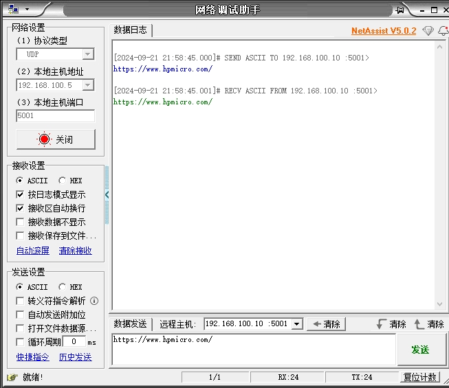

# lwip_udpecho

## 概述

本示例展示UDP回送通讯

- PC 通过以太网发送UDP数据帧至MCU，MCU将接收的数据帧回发至PC

## 硬件设置

* 使用USB Type-C线缆连接PC USB端口和PWR DEBUG端口
* 使用以太网线缆连接PC以太网端口和开发板RGMII或RMII端口

## 工程配置

- 以太网端口配置：参考 [以太网通用工程设置](../doc/Ethernet_Common_Project_Settings_zh.md)
- 以太网DHCP配置
  - lwIP sample:  在 `CMakeLists.txt`中，支持如下配置:
    - sdk_compile_definitions(-DLWIP_DHCP=0): 禁用DHCP功能
    - sdk_compile_definitions(-DLWIP_DHCP=1): 启用DHCP功能

## 运行示例

* 编译下载程序
* 串口终端显示如下信息：

  ```console
  This is an ethernet demo: UDP Echo (Polling Usage)
  LwIP Version: 2.1.2
  Enet phy init passed !
  Link Status: Down
  Link Status: Up
  Link Speed:  1000Mbps
  Link Duplex: Full duplex
  IPv4 Address: 192.168.100.10
  IPv4 Netmask: 255.255.255.0
  IPv4 Gateway: 192.168.100.1
  ```
* 打开以太网调试工具

  - 选择协议类型：UDP
  - 选择本地主机地址及端口
  - 打开
  - 选择远程主机地址及端口
  - 在数据发送窗口编辑发送字符
  - 观察回送数据

    
