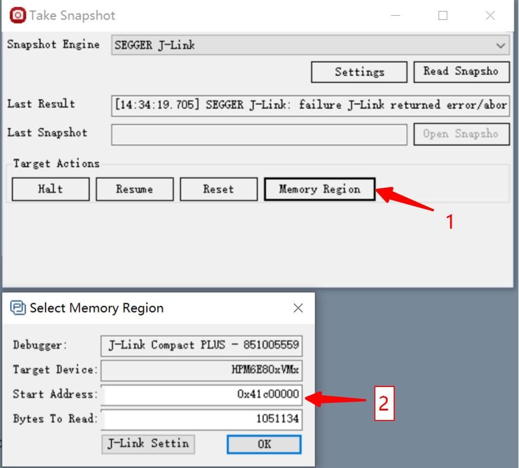
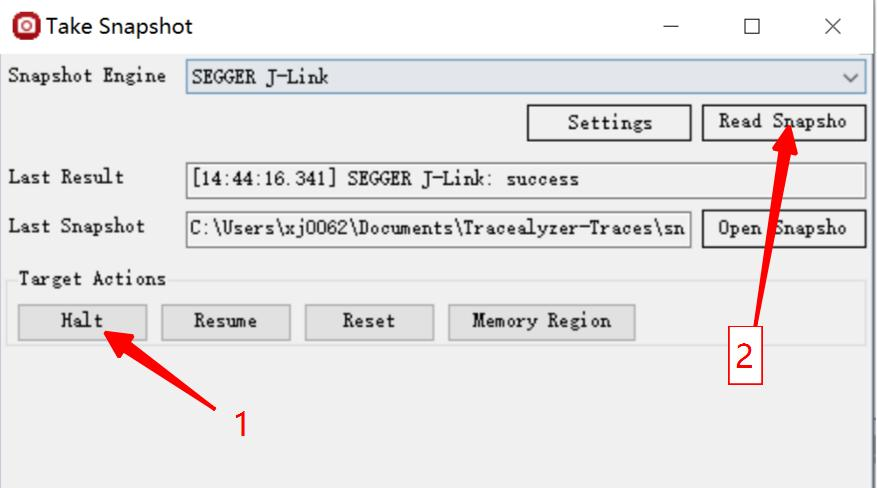
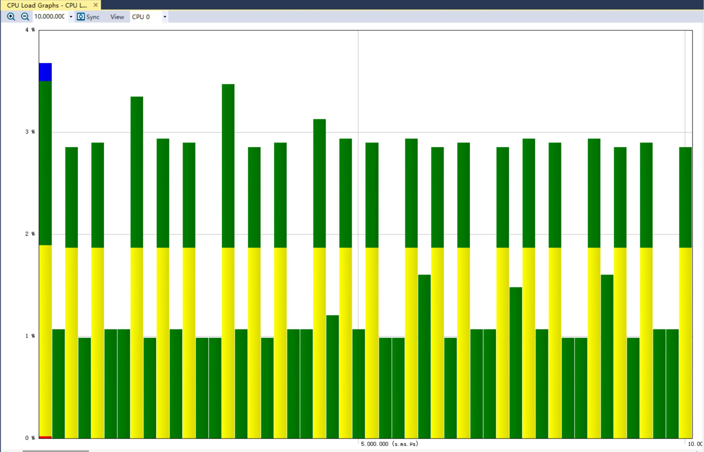

# Trace Recorder FreeRTOS

## Overview

This project demonstrates the task scheduling function of Trace Recorder for tracking FreeRTOS.

## Hardware Setup

- It is recommended to use JLink for tracking.
- GDB only supports snapshot mode.

## Operation Steps
### Snapshot mode
Add "set(CONFIG_TRACE_RECORDER_SNAPSHOT_MODE 1)" and remove "set(CONFIG_TRACE_RECORDER_STREAM_MODE "JLink RTT")" in CMakeLists.txt to enable snapshot mode. Some hpm_build_type is not supported because there maybe not enough memory to save trace data, such as flash_xip and ram.
In snapshot mode, TraceRecorder stores data in memory. The data needs to be exported and then analyzed using a host computer tool.

#### Obtain the address where data is stored
- Open the generated.map file after compilation, search for RecorderData, and you can see its address and size.

#### Export snapshot data
##### Using GDB
First, open the GDB Server (openocd/JLink GDB Server), use GDB to connect to the target, and pause the execution of the program.
```
tar remo :2331
mo halt
dump binary memory target_data.bin {start address of RecorderData} {end address of RecorderData}
```
Then open the Tracealyzer4 software and open the target_data.bin file.
##### Using JLink
Open the Tracealyzer4 software, open snapshot mode, switch to the JLink interface, and select the target chip in the JLink configuration. In the JLink configuration, select the target chip.


In the memory configuration, configure the starting address and size of RecorderData.


Pause the execution of the target program and then read the data.

### Stream mode
Add "set(CONFIG_TRACE_RECORDER_STREAM_MODE "JLink RTT")" and remove "set(CONFIG_TRACE_RECORDER_SNAPSHOT_MODE 1)" to CMakeLists.txt to enable stream mode.
#### Obtain the address of the JLink RTT control block
Open the generated.map file after compilation, search for the _SEGGER_RTT variable, and you can obtain its address.

#### Host computer software configuration
First, open the Tracealyzer4 software, open stream mode, switch to the JLink interface, and select the target chip in the JLink configuration. Configure the RTT control block address and the RTT channel sequence number (default is 1).

In the control interface, start data capture. Click buttons "Reset, Reconnect, Start Session" in order.


## Running the example
### Snapshot mode


### Stream mode
Data can be viewed dynamically without halting the cpu.