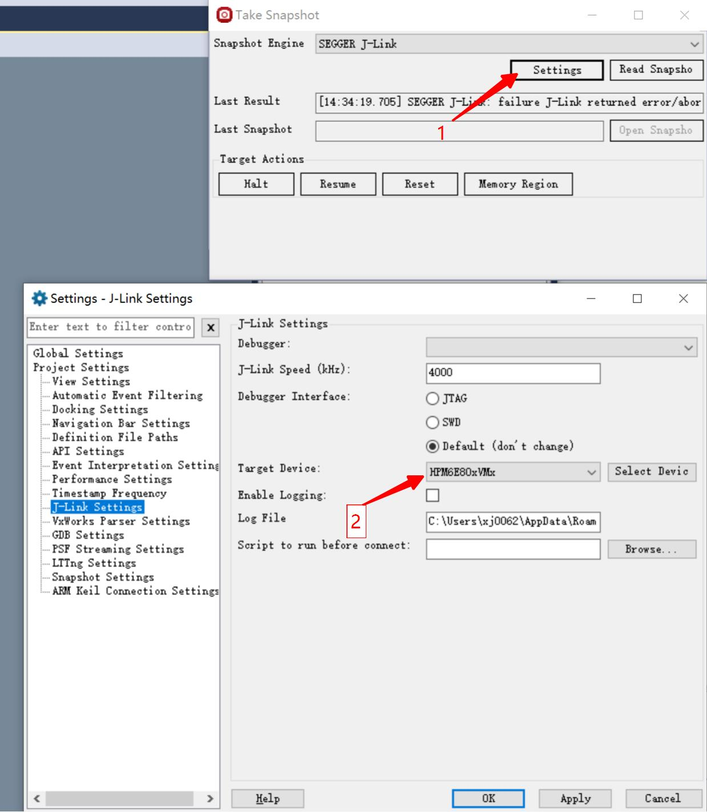

# Trace Recorder FreeRTOS

## 概述

该工程演示了Trace Recorder跟踪freertos的任务调度功能。

## 硬件设置

- 推荐使用JLink进行跟踪
- GDB只支持快照模式

## 操作步骤
### 快照模式
在CMakeLists.txt中加入set(CONFIG_TRACE_RECORDER_SNAPSHOT_MODE 1)并删除set(CONFIG_TRACE_RECORDER_STREAM_MODE "JLink RTT")从而使能快照模式。因为需要大量的内存存储跟踪的数据，所以在一些内存较小的配置下，此模式可能不被支持，例如当构建方式为ram和flash_xip时。
快照模式下，TraceRecorder将数据存储在内存中，需要将数据导出，然后使用上位机工具进行分析。

#### 获取数据存储的地址
- 打开编译生成的.map文件，搜索RecorderData，即可看到其地址和大小

#### 导出快照数据
##### 使用GDB
首先打开GDB Server(openocd/JLink GDB Sever),使用GDB连接目标，并暂停程序的执行
```
tar remo :2331
mo halt
dump binary memory target_data.bin {start address of RecorderData} {end address of RecorderData}
```
然后打开tracealyzer4软件，打开target_data.bin文件即可
##### 使用JLink
打开tracealyzer4软件，打开snapshot模式，切换到JLink接口，并在JLink配置中选择目标芯片


在内存配置中配置RecorderData的首地址和大小


暂停目标程序执行，然后读取数据。

### 流模式
在CMakeLists.txt中加入set(CONFIG_TRACE_RECORDER_STREAM_MODE "JLink RTT")并删除set(CONFIG_TRACE_RECORDER_SNAPSHOT_MODE 1)从而使能流模式。
#### 获取JLink RTT控制块地址
打开编译生成的.map文件，搜索_SEGGER_RTT变量，即可获取其地址

#### 上位机软件配置
首先打开tracealyzer4软件，打开stream mode，切换到JLink接口，并在JLink配置中选择目标芯片,配置好RTT控制块地址，以及RTT的通道序列号（默认为1）

在控制界面中，开启数据抓取: 依次点击Reset, Reconnect, Start Session。


## 运行现象
### 快照模式


### 流模式
不用暂停cpu就可以动态的查看数据。