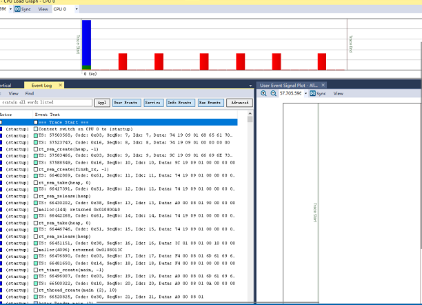

# Trace Recorder RT-Thread

## Overview

This project demonstrates the task scheduling function of Trace Recorder for tracking FreeRTOS.

## Hardware Setup

- Only stream mode using JLink is supported.

## Operation Steps
### Prepare the config file
Copy the "RTThread-psf.xml" in the "middleware\trace_recorder\kernelports\rtthread-nano\config" and the "RTThread-v1.0.0.xml" in the same path to the "cfg" folder within the installation directory of Tracealyzer.
### Stream mode
Add "set(CONFIG_TRACE_RECORDER_STREAM_MODE "JLink RTT")" to CMakeLists.txt to enable stream mode. Only stream mode is supported in RT-Thread.
#### Obtain the address of the JLink RTT control block
Open the generated.map file after compilation, search for the _SEGGER_RTT variable, and you can obtain its address.

#### Host computer software configuration
First, open the Tracealyzer4 software, open stream mode, switch to the JLink interface, and select the target chip in the JLink configuration. Configure the RTT control block address and the RTT channel sequence number (default is 1).

In the control interface, start data capture. Click buttons "Reset, Reconnect, Start Session" in order.

## Running the example
Data can be viewed dynamically without halting the cpu.
