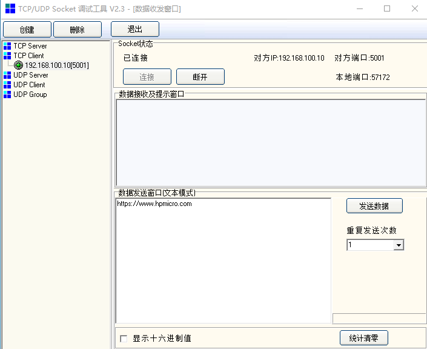
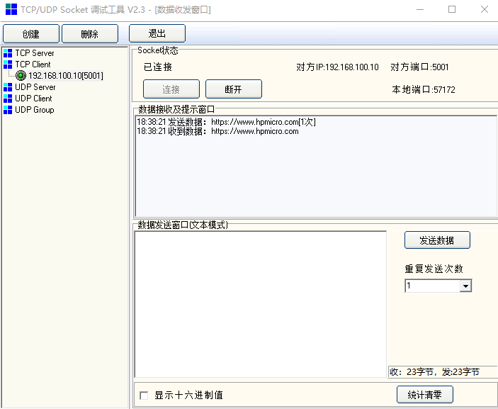

# lwip_tcpecho

## Overview

This example shows TCP echo communication.

- PC sends TCP data frames to MCU,  and then MCU sends the data frames back to PC

## Board Settings

- Connect a USB port on PC to the PWR DEBUG port on the development board with a USB Type-C cable
- Connect an Ethernet port on PC to a RGMII port or a RMII port on the development board with an Ethernet cable

## Project Configurations

- Ethernet Port Settings: Refer to [Ethernet common project settings](../doc/Ethernet_Common_Project_Settings_en.md)
- Ethernet DHCP Configurations
  - the configurations in the `CMakeLists.txt` as follows:
    - sdk_compile_definitions(-DLWIP_DHCP=0): Disable DHCP feature
    - sdk_compile_definitions(-DLWIP_DHCP=1): Enable DHCP feature

## Run Example

- Compiling and Downloading
- Running log is shown in the serial terminal as follows:

  ```console
  This is a TSW demo: TCP Echo (Polling Usage)
  LwIP Version: 2.1.2
  Enet phy init passed !
  Link Status: Up
  Link Speed:  1000Mbps
  Link Duplex: Full duplex
  IPv4 Address: 192.168.100.10
  IPv4 Netmask: 255.255.255.0
  IPv4 Gateway: 192.168.100.1
  ```
- Run an Ethernet debugging tool

  - create and set a TCP client:  TCP Server IP: 192.168.100.10/Port: 5001

    **Note: There is a necessary adjustment for Server IP according to the segment of  LAN where PC resides**
  - Connect
  - Enter and send any characters in the edit window

    
  - Watch the characters echoed from MCU

    
