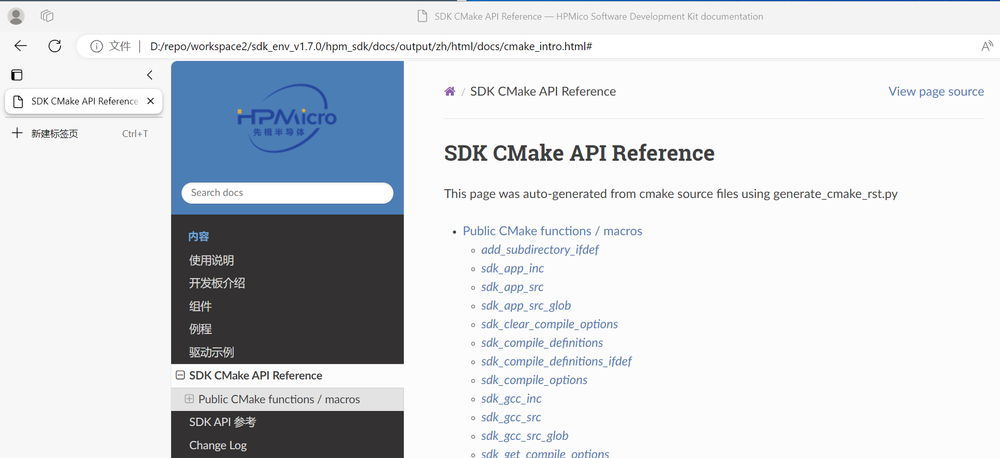
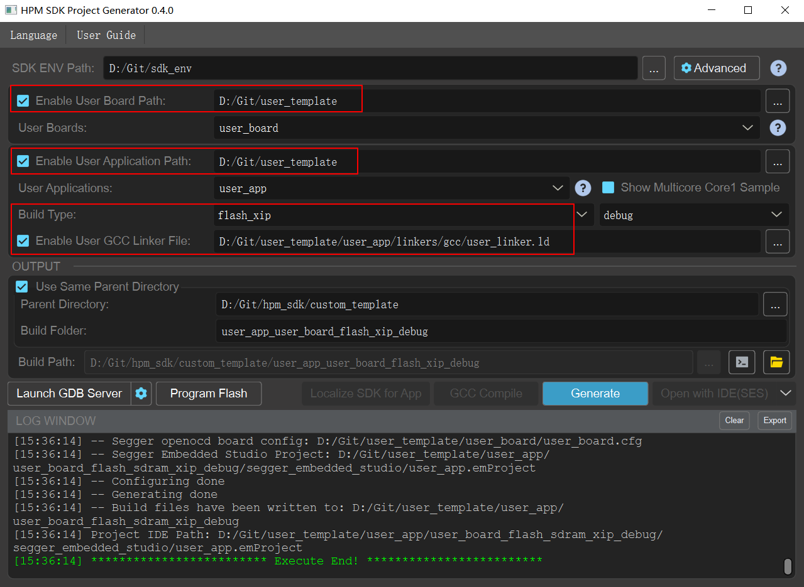

# USER TEMPLATE

## OVERVIEW

This project is a user template, and users can copy the folder to their custom working directory for development based on this template.

The user-defined files in this template are:

- User Board
- user App
- User Linker

## User Board

In the `user_board` folder, there is a `yaml` file and a `cfg` file, and the names of these two files must be consistent with the folder name, so that start_gui can recognize the folder as a board folder.

Among them, the `yaml` file is a user board level configuration file used to configure SOC names, openocd scripts, etc. The `cfg` file is a board level configuration file for openocd, which specifies parameters for onboard flash, debugger reset-init event handling, debugger gdb-attach event handling, etc.

Usually, users can copy files from the hpm_sdk/boards/hpm_xxxx_evk directory to the user_board folder, and copy the `cfg` file from the evk directory of hpm_sdk/boards/openocd/boards to the user-board folder, and then make modifications based on their own board configuration.

- < Note >: After copying, please modify the file names of `yaml` and `cfg` to match the folder name.

The files in the `user_board` folder in this template were copied from the relevant files of hpm6750evk2. Users can replace or modify them according to their own board configuration

## User App

In the `user_app` folder, users can organize their own applications, such as the main function.

When adding .c and .h files, please use `sdk_app_src` to add the .c files and use `sdk_app_inc` to add the path of the .h files in `CMakeList.txt`.

If using `middleware`, `components`, etc., please refer to the `CMakeList.txt` in the sample corresponding to hpm_sdk, and then add relevant instructions in the user's `CMakeList.txt` following the example.

The cmake commands supported in the HPM_SDK can be viewed in `hpm_sdk\docs\index_zh.html`:

- Tips: After modifying `CMakeList.txt`, the project needs to be regenerated and compiled.

## User Linker

In the `user_app` folder, there are `linker` files for the application, which users can customize according to their own needs.

Usually, users can copy the linker files from the `gcc`/`iar`/`segger` folder in hpm_sdk/soc/xxxx/xxxx/toolchains to user app/linkers and make modifications based on them.

- < Note >: After copying, the linker file names under the `gcc`/`iar`/`segger` files should be consistent, only with different suffixes.

Users can specify the Linker file to be used in the user application's `CMakeList.txt`. If a Linker file is not specified in `CMakeList.txt`, it can also be specified when generating the project using `start_gui` Tool.

If a Linker file is not specified in either of the above cases, the SDK's default linker file will be used, which is located in hpm_sdk/soc/xxxx/xxxx/toolchains.

## START_GUI DEMO

After organizing the above files, you can use start_gui to generate your own project project.

- Board Path：Specify the top-level `user_template` folder, start_gui will automatically search for board level files in that folder.
- Application Path：Specify the top-level `user_template` folder, start_gui will automatically search for applications in that folder.
- User GCC Liner File：Specify user `gcc` linker files. After generating the project, the gcc toolchain will use the linker in the gcc folder, the iar toolchain will use the linker in the iar folder, and the segger toolchain will use the linker in the segger folder.
  - < Note >: The `Build Type` of start_gui needs to be correctly specified in conjunction with the linker file. For example, when the linker file uses Flash and there is no SDRAM, the `Build Type` of start_gui needs to be specified as `flash_xip`; When the linker file uses Flash and has SDRAM, the `Build Type` of start_gui needs to be specified as `flash_stram-xip`.
- After configuration, click `Generate` to generate the project.
  - < Note >: After modifying `CMakeList.txt`, the project needs to be regenerated and compiled.