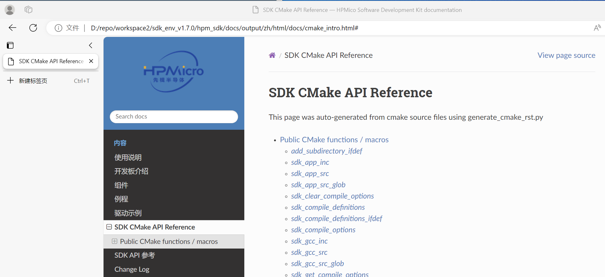
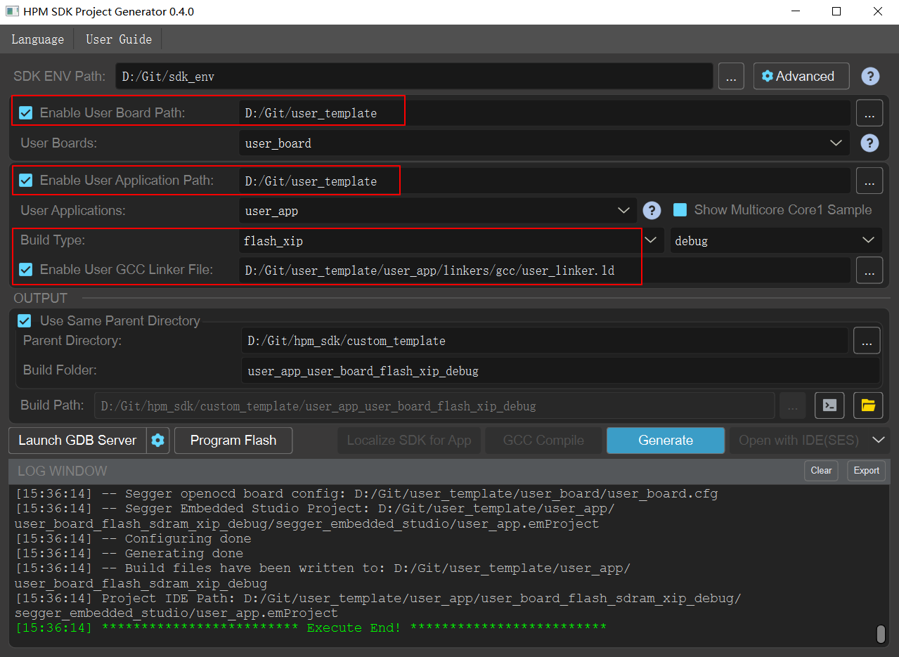

# 用户模板

## 概述

本工程是用户模板，用户可将该文件夹复制到用户自定义的工作目录中，基于此模板进行开发。

本模板主要牵涉到的用户自定义的文件有：

- 用户板级文件Board
- 用户应用程序App
- 用户链接脚本Linker

## 用户板级文件Board

在`user_board`文件夹下，有一个`yaml`文件和一个`cfg`文件，这两个文件的名称**必须**要跟文件夹名称一致，这样start_gui才能识别出该文件夹为板级文件夹。

其中，`yaml`文件是用户板级配置文件，用于配置soc名称、openocd脚本等。`cfg`文件是openocd的板级配置文件，指定板载Flash的参数、调试器reset-init事件处理、调试器gdb-attach事件处理等。

通常，用户可将hpm_sdk/boards/hpm_xxxx_evk目录中文件复制到user_board文件夹下，将hpm_sdk/boards/openocd/boards目录evk对应的`cfg`文件复制到user_board文件夹下，然后在其基础上根据自身板子的配置进行修改。

- <注意>：复制过来后，请修改`yaml`和`cfg`文件名称，与文件夹名称保持一致。

本模板中的`user_board`文件夹的文件是从hpm6750evk2相关文件复制过来的，用户可根据自身板子的配置情况将其替换或修改。

## 用户应用程序App

在`user_app`文件夹下，用户可组织自己的应用程序，例如main函数等。

添加的.c文件和.h文件时，请在`CMakeList.txt`中使用`sdk_app_src`添加.c文件，使用`sdk_app_inc`添加.h文件的路径。

若使用到`middleware`、`components`等，请参考hpm_sdk对应sample中的`CMakeList.txt`，然后在依葫芦画瓢在用户的`CMakeList.txt`中添加相关指令。

HPM_SDK中支持的cmake指令可在hpm_sdk\docs\index_zh.html中查看：

- Tips：修改`CMakeList.txt`后，需要重新生成工程并编译，才能生效。

## 用户链接脚本Linker

在`user_app`文件夹下，有该应用程序的`linker`文件，用户可根据自身的需求自定义该文件。

通常，用户可将hpm_sdk/soc/xxxx/xxxx/toolchains中的`gcc`/`iar`/`segger`文件夹中的linker文件复制到user_app/linkers中，在其基础上进行修改。

- <注意>：复制过来后，`gcc`/`iar`/`segger`三个文件下的linker文件名称保持一致，仅后缀不一样。

本模板中的linker文件是从hpm6750evk2的flash_xip liner文件复制过来的，用户可根据自身板子的配置情况将其替换或修改。

用户在应用程序的`CMakeList.txt`中可以指定使用的Linker文件，如果在`CMakeList.txt`中不指定Linker文件，也可在start_gui生成工程的时候指定Linker文件。

如果以上两种情况都不指定Linker文件，则会使用SDK默认的linker文件，位于hpm_sdk/soc/xxxx/xxxx/toolchains中。

## START_GUI的使用

上述的文件组织完毕后，可使用start_gui生成自己的project工程。

- Board Path：指定顶层的`user_template`文件夹，它将自动搜索该文件夹下的板级文件。
- Application Path：指定顶层的`user_template`文件夹，它将自动搜索该文件夹下的应用程序。
- User GCC Liner File：指定用户自定义的gcc linker文件。生成project后，gcc工具链将使用gcc文件夹下的linker，iar工具链将使用iar文件夹下的linker，segger工具链将使用segger文件夹下的linker。
  - <注意>: start_gui的`Build Type`需要配合linker文件正确指定。例如，当linker文件使用到Flash且没有SDRAM时，start_gui的`Build Type`需要指定为`flash_xip`；当linker文件使用到Flash且有SDRAM时，start_gui的`Build Type`需要指定为`flash_sdram_xip`。
- 配置完毕后，点击`Generate`，即可生成工程。
  - <注意>: 修改`CMakeList.txt`后，需要重新生成工程并编译，才能生效。